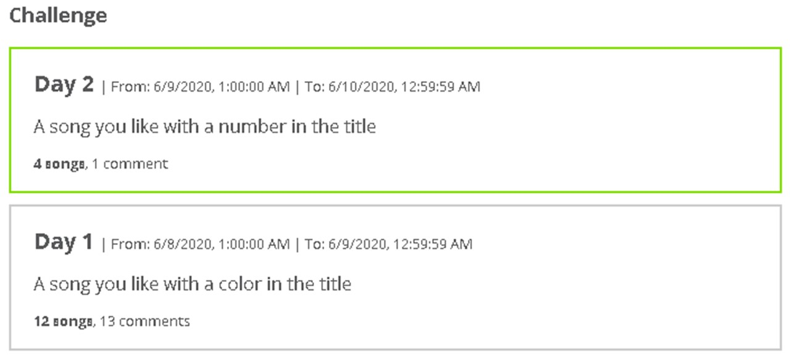

## Social (Distancing) Committee presents

On behalf of our Social Committee, it is my pleasure to introduce the [EPP Music Challenge](https://https://nowickilab.science/music-challenge/). This activity is intended to bring [our department](https://epp.tennessee.edu) together during the Jumanji version 2020.

 We play Mon-Fri (no weekends or holidays). The next day challenges is revealed as the midnight strikes in West TN.
 
On the website you can post a song/music that you like, related to each day's topic. You will only be able to post on the active day, but will be able to view and comment on previous days. The topic will change at midnight Central Time each day. Please do not post more than two song/music entries for each day.

When you post a song you can post under your name or an alias, share a story behind the reason for posting the song, or fun facts you know about it. Much like with facebook and twitter, we can comment on others' music and stories. We have also secured plenty of "likes" ❤️ to give out. Commenting and liking is not limited to the current day topic.

Likes (admiration of others) and bringing joy into other peoples' lives is the real price here. We do not anticipate any tangible awards. BUT, each day, a song with most ❤️s will be made visible in the archive display.

Bring your Significant Other, family, friends, UTK community... The more the merrier!

