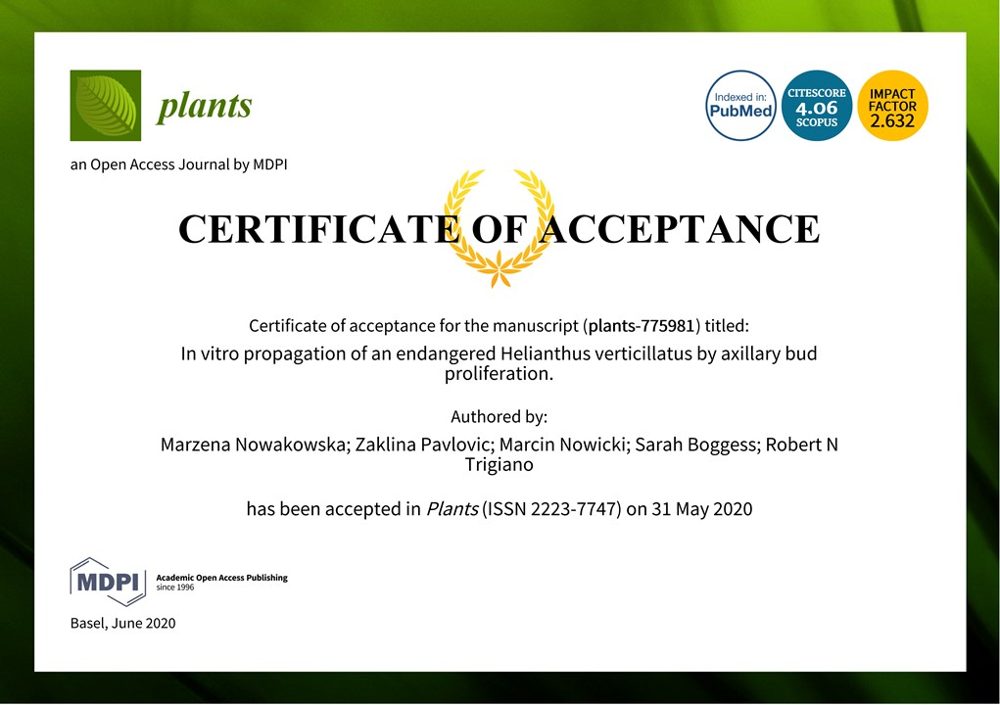

## 3nd paper out in 2020

In our paper with the colleagues from the [EPP, UTK](htpps://epp.tennessee.edu) we applied a simple tissue culture protocol towards multiplication of the endangered whorled sunflower, as a part of the recovery plan for its restoration and protection. This species is restricted to a few locations in the Southeastern United States, and carries important ornamental and utilitarian traits. Habitat loss has caused *H. verticillatus* to become rare, and since 2014, it has been federally listed as an endangered species.

The manuscript just got accepted to the [Special Issue of MDPI Plants: Plant Tissue Culture](https://https://www.mdpi.com/journal/plants/special_issues/plant_tissue_culture). In there, we describe how 6 separate genotypes of whorled sunflower react to induction of their axillary buds, regeneration *in vitro*, and then growth in the greenhouse. 

Specifically, we tested how concentration of a plant hormone important for lateral growth impacts the axillary bud activation.

The tested concentrations of the phytohormone differed in their impacts on the induction of the buds, with the moderate concentrations tested working the best. The plants recovered the best (rooting and growth, no callus) when no additional phytohormones were present in the regeneration medium. Even though 2 genotypes recovered poorer than the rest, subsequent cycles of culture on the regeneration medium brought them back, which suggests a major misbalance of the phytohormones *in vitro*.

This is first of the series of papers I'm engaged in, that include this exciting endangered species.

 