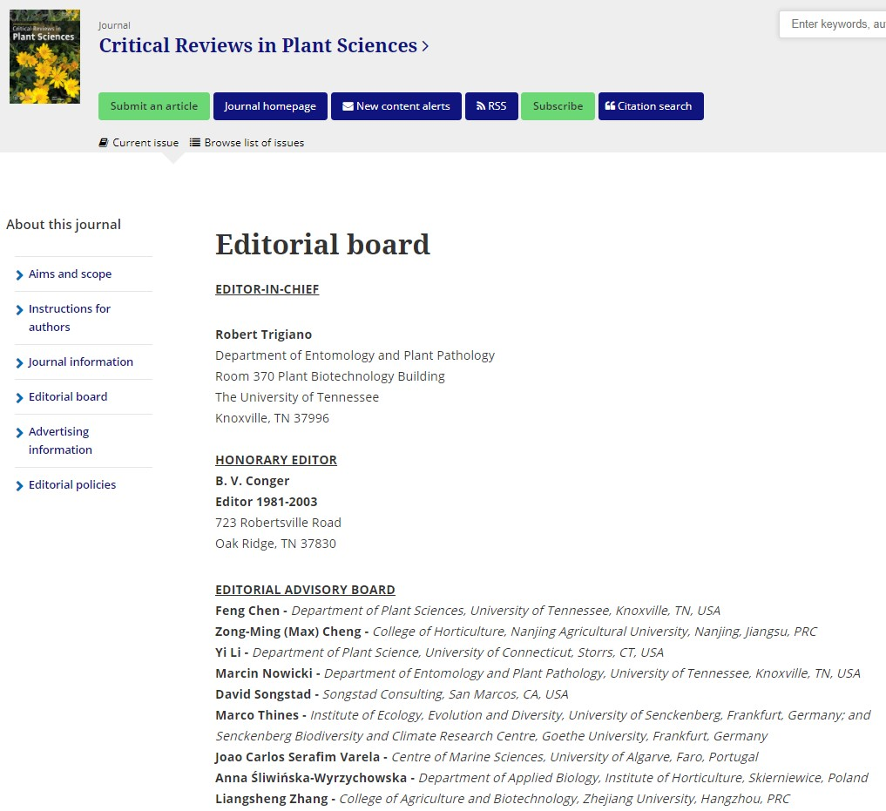
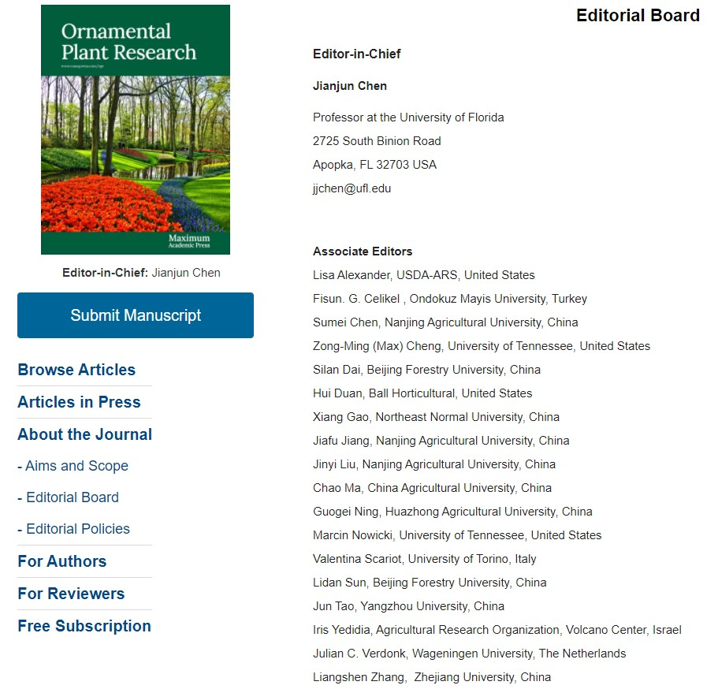

## PI a member of Journal Editorial Boards

What a year it was!

On top of everything else that's happened and was outlined so far (and few more details coming), I was fortunate to join two Editorial boards.

The reputable [Critical Reviews in Plants Sciences](https://www.tandfonline.com/action/journalInformation?show=editorialBoard&journalCode=bpts20) approached me about joining their Board of Editors. In the past, I served as ad-hoc manuscript pre-screen, and advices on several submissions in 2020 alone. Joining this top-rank journal is certainly a mark of distinction.

Another distinction is to be invited to the Founding Editorial Board of a new journal, [Ornamental Plant Research](http://www.maxapress.com/opr/news/solo-detail/editorial_board). Here, I believe my contributions and help in the last several Horticulture Research annual conferences left a mark. This journal seems very relevant to my current projects, and thus has merit in me joining their ranks. Also, I highly encourage submitting to this ambitious new title!

 
 