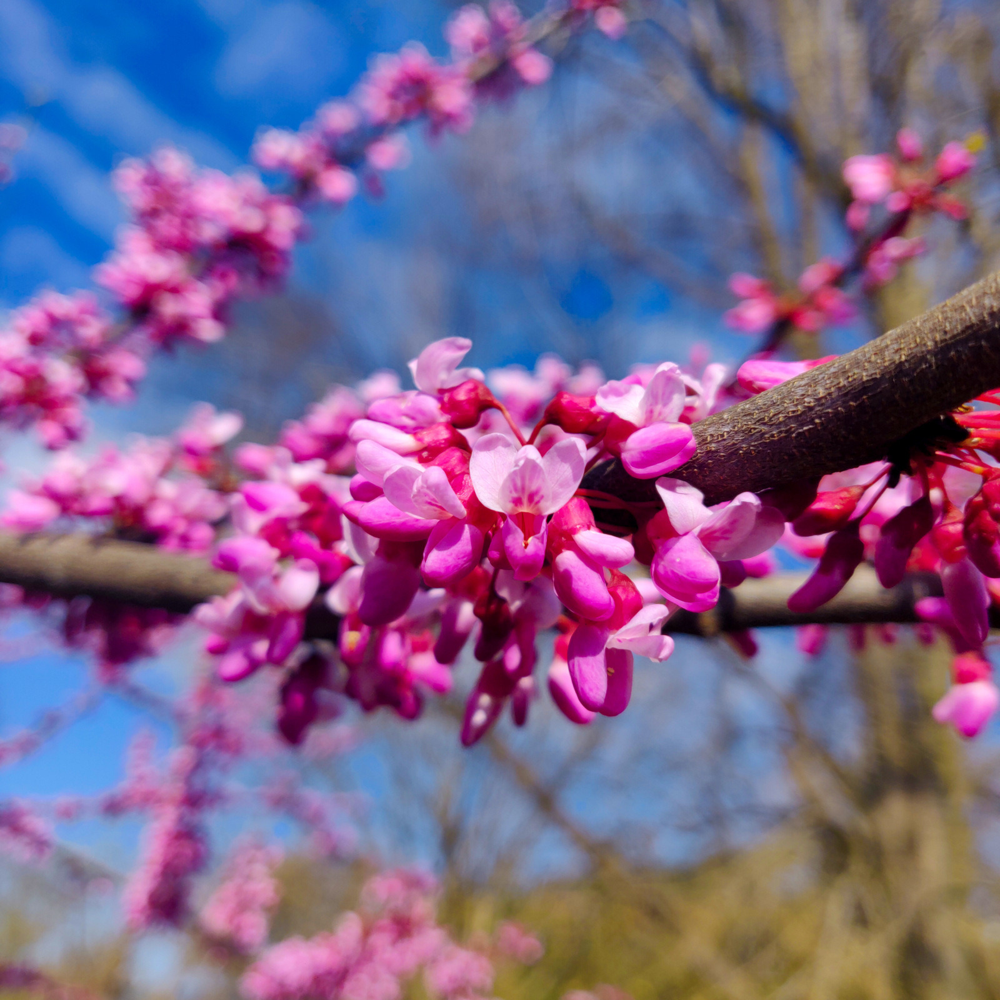
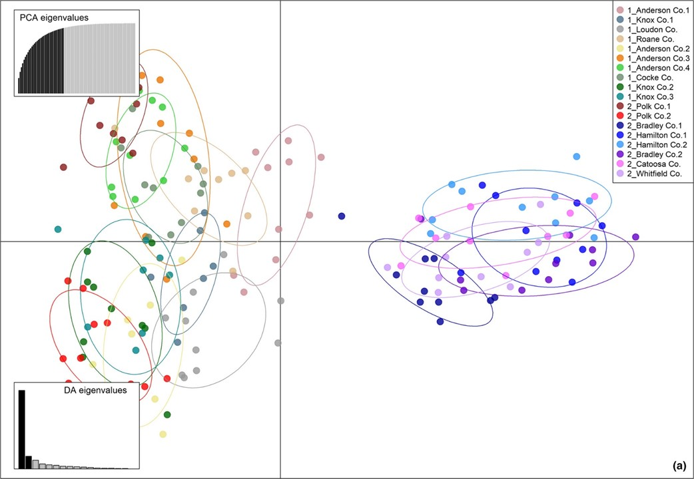

---
slug: new-papers-1
---

---title: New papers about Eastern Redbud, Cercis canadensis L.slug: redbud-meher-paperdate: 2020-05-01summary: Meher Ony MS publishes her thesis research on redbud diversity.tags: ['redbud', 'diversity', 'evolutionary history']img:---## 1st paper out in 2020Recent global events did affect us, but work from home goes on.So, the shoutout to Meherafroze Ony, recent MS from Dr. Hadziabdic's lab, for becoming a published scientist!In her thesis, Meher analyzed species-wide diveristy of Easter Redbud (_Cercis canadensis_ L.), at two levels: at fine scale in the Southern Appalachia region, and across the species native range (roughly, __half of lower US__).The first report on the fine-scale analyses [was recently published](https://onlinelibrary.wiley.com/doi/full/10.1002/ece3.6141) in the reputable [Ecology and Evolution](https://onlinelibrary.wiley.com/journal/20457758) (OpenAccess, so everyone's welcome!). The second report is to be submitted shortly.Meher is a great storyteller, as this paper exemplifies (and __SPOILER__ so does the second __SPOILER__). In short, despite habitat fragmentation and loss (=differentiation), at fine-scale the species managed to retain high levels of diversity.But, you really need to read all that yourselves!

