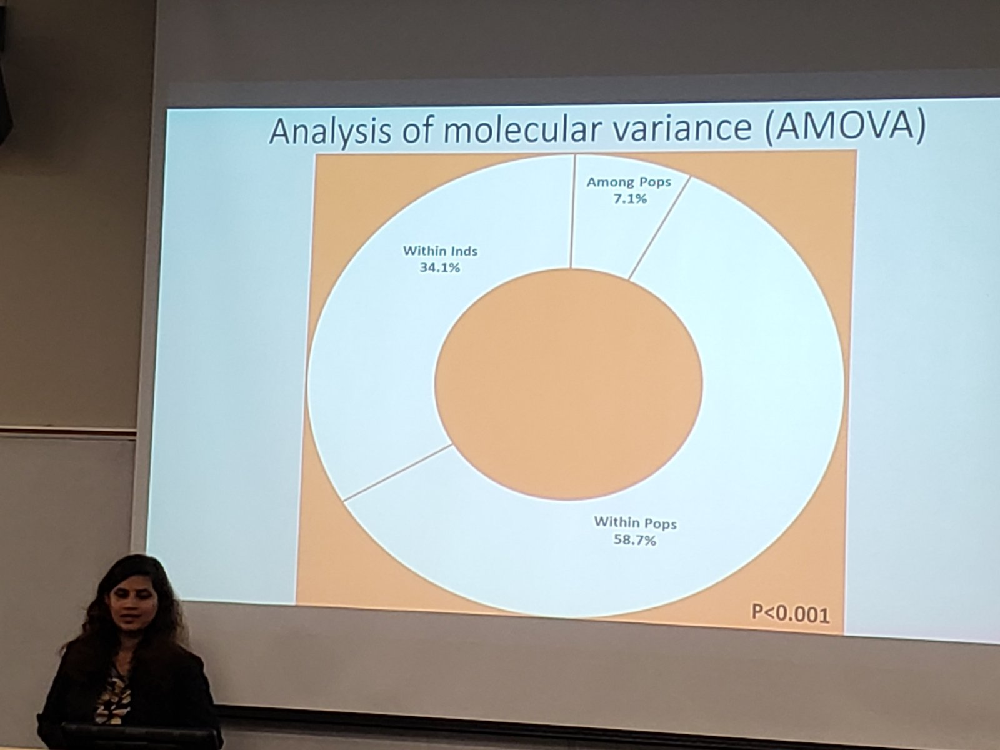
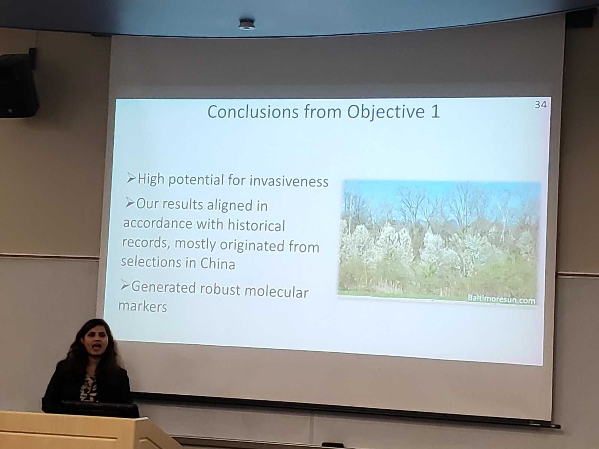
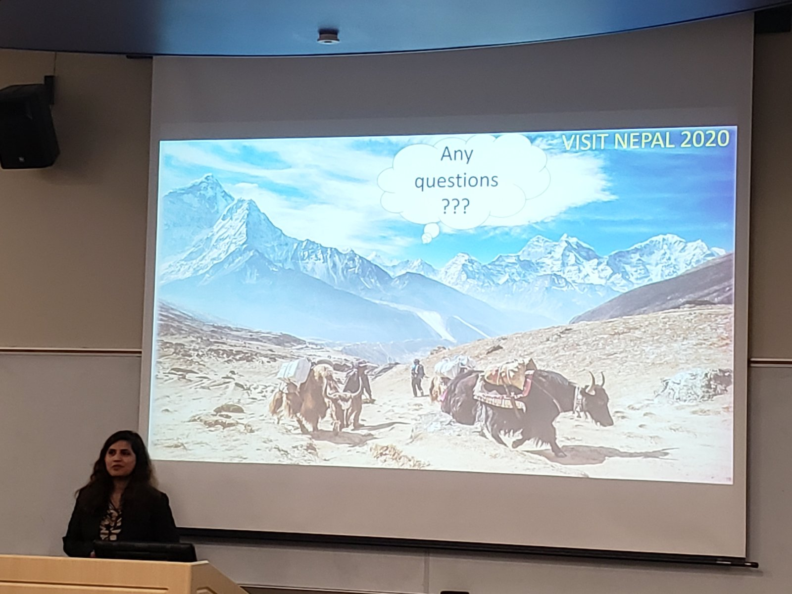

## It's official
Last Friday of Feb 2020, the whole [EPP department](https://epp.tennessee.edu) attended the [MS proposal seminar](https://liveutk-my.sharepoint.com/:v:/g/personal/epp1_utk_edu/EcsQ_9FLH4RKnCET6E72lnYB5HcN5vdsT0VY_q1dXOx6jQ?e=4%3avDU5Ng&at=9). Shiwani was presenting her MS thesis rationale and the emerging results.

We were excited to share our passion for this project, and how much we've learned so far, and what's still ahead. It was Shiwani's first ever public podium presentation, and I am very proud of her delivery.

The presentation was a group effort, with several version and many hours of our colelctive time (THANK YOU, Sarah and Meher!). But, we received a very positive feedback. Especially, one faculty wrote us:

> I was very impressed with your seminar – it was very well organized and presented. I see that you and your major advisor work well together and are going to produce terrific research.

> I look forward to seeing the rest of your results.

Very well done, Shiwani!

