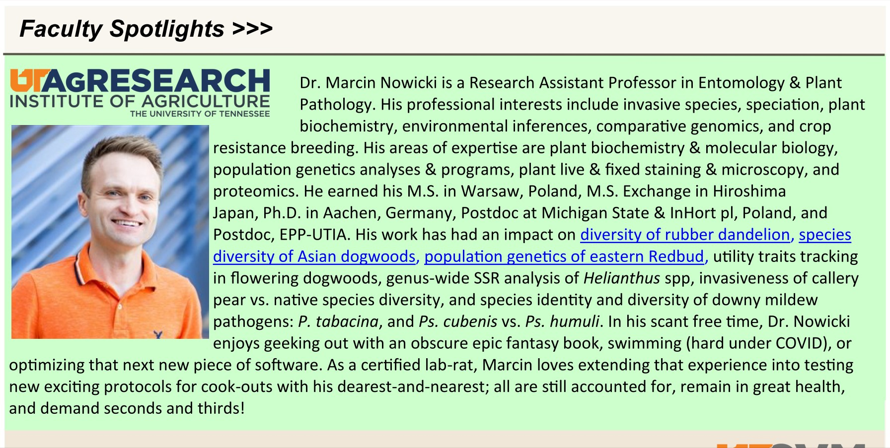

## PI featured in the UT Institute of Agriculture newsletter

It's a humbling news, it is, but publicity is great for outreach and networking, so...

[University of Tennessee Institute of Agriculture](https://utia.tennessee.edu) put out a brief summary on my background and impacts. I'm grateful that after mere 4 years of service here and just 1 year after promotion to Research Assistant Professor I'm already getting put in spotlight in [our quarterly newsletter](http://taes.utk.edu/upload/AgRsch/SponsoredPrograms/OSP_Fall_2020_Newsletter(2).pdf).

This is a great honor to be recognized in this way, but also motivates me to work even harder - so as to keep the good momentum going. So far, things are looking great in this regard, as 2020 turned out a very productive year We still have several more impactful research stories that we're working on towards publication. 

 