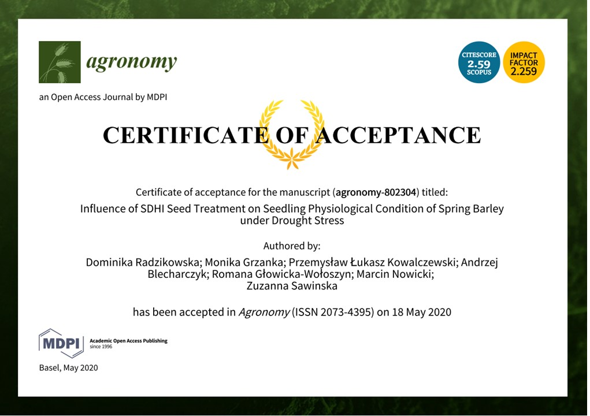

## 2nd paper out in 2020

In our paper with the colleagues from the [Poznan University of Life Sciences, Poland,](https://skylark.up.poznan.pl/en/) we investigate how seed mortars affect barley response to the drought stress.

The manuscript just got accepted to the [Special Issue of Agronomy: Mechanism and Improvement of Drought Resistance in Crops](https://www.mdpi.com/journal/agronomy/special_issues/drought_mechanism). In there, we describe how 7 various seed treatments affect the barley seed physiology at the seedling stage under drought, and after reversal of the stress. 

Specifiacally, seed treatments help reduce the pathogen load and thus improve the condition of plants from their earliest developmental stages. But, they can have impacts beyond their basic role of fungicide protection.

 The tested 7 seed treatments differed in their impacts on the vigor parameters of the barley seed and on the physiological state of seedlings under drought stress and after regeneration. Seed treatments based on the substances from the SDHI group did not cause inhibition of the seedling growth. Using the analysis of photosynthesis-related parameters, we showed that seed treatments from the SDHI group provided a superior tolerance of the imposed drought in spring barley than other treatments. In addition to protection against abiotic stress, SDHI treatments also rendered a higher efficiency of the photochemical reactions in the treated plants.

 I'm way beyond excited for this collaborative project, and beyond.

 