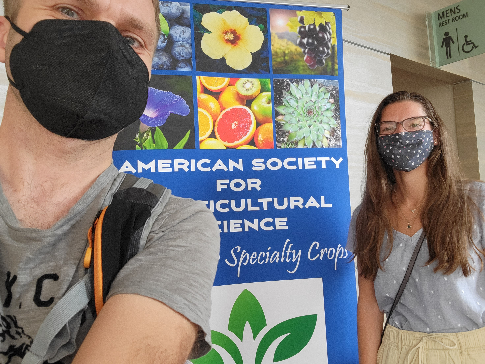
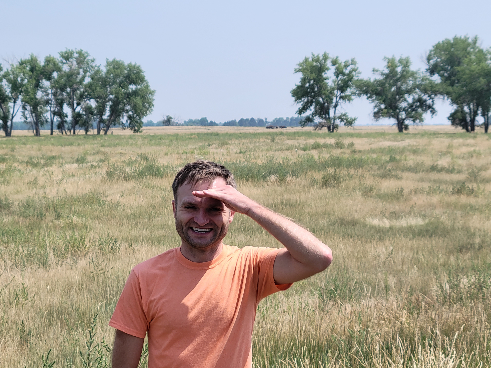
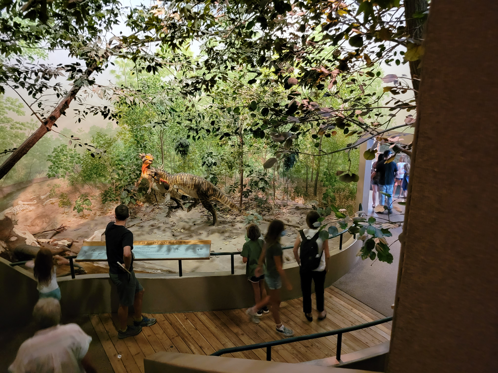
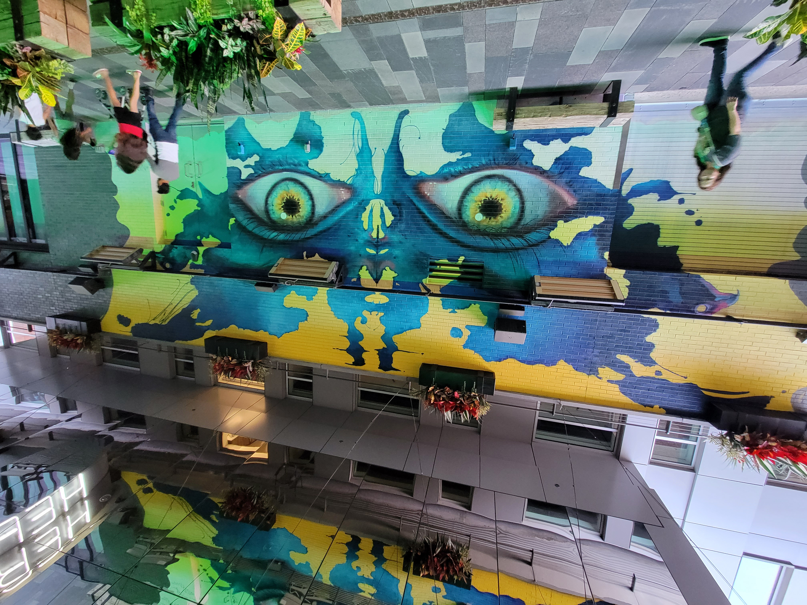
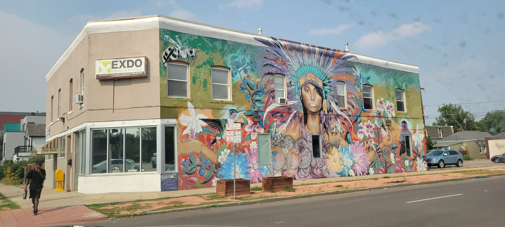
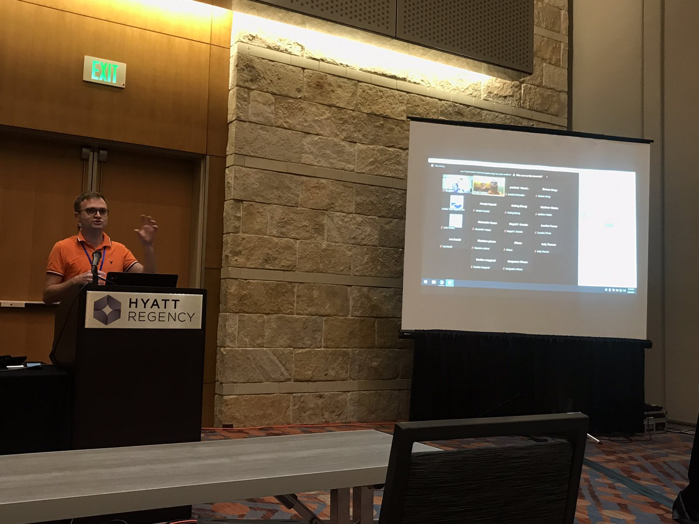
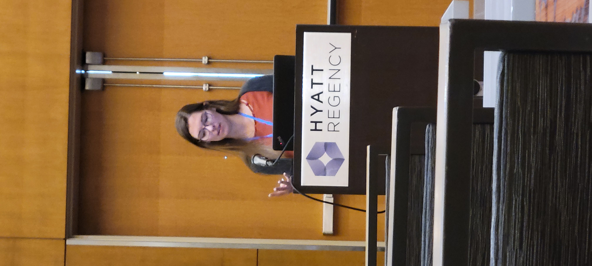
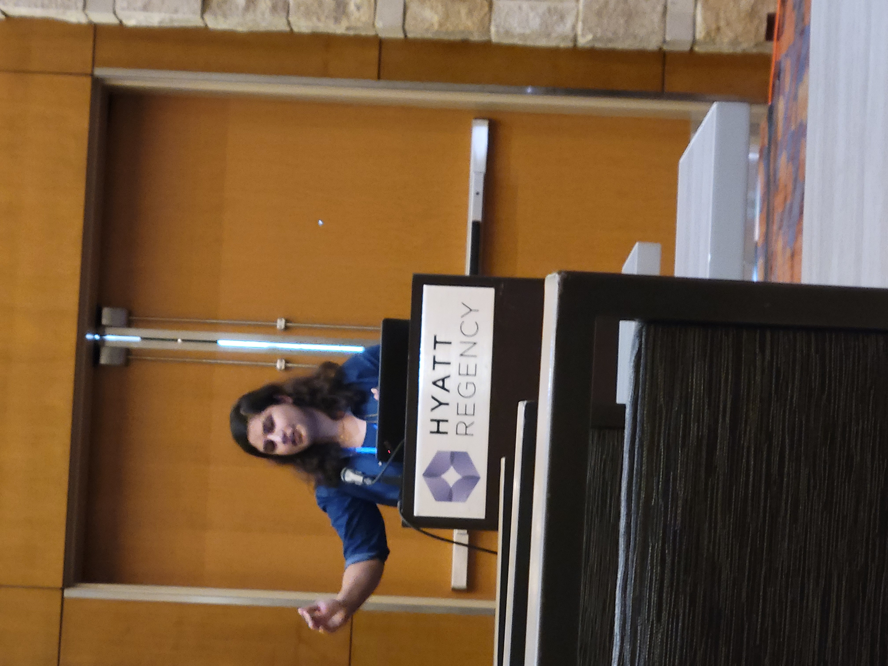
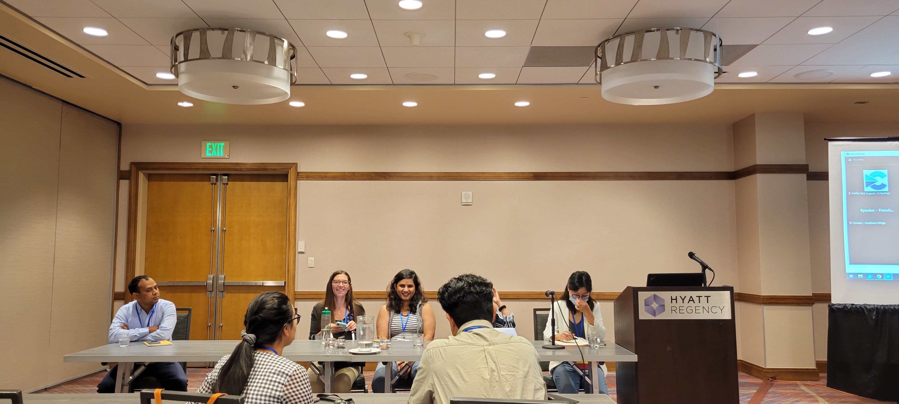
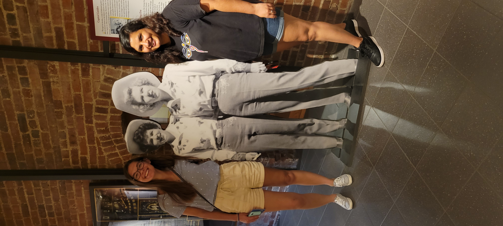

---
slug: conference
---

---title: Annual ASHS conferenceslug: ashsdate: 2021-08-11summary: Group attendaning the ASHS caps the MS students graduationtags: ['research', 'academic life', 'conference', 'research dissemination']img:---## We're going CO! Last year, we were very fortunate to [attend a professional meeting](/news/invasive-species-forum/) right before it hit the world.This year, with vaccinations and masks, travel to Denver, CO, was not much more difficult than it usually is.With [Trinity](/publications/viburnum01/) and [Shiwani](/people/shiwani-sapkota/), we attended the annual [ASHS meeting](https://ashs.confex.com/ashs/2021/meetingapp.cgi). Both students presented a poster and a podium item, several times (#StudentCompetitions). I was fortunate to summarize the results from our upcoming _Helianthus_ project. Also, I was asked to judge student poster presentations, 3min talks, and was responsible for Best 2020 Ornamental Publication committee work.Shiwani spoke about her data on the [invasive Callery pear](/projects/asian-callery-pear/). In the poster, she briefed the audience on the fine-scale genetics implications and future steps. In her talk, she presented the first part of her MS, the develpment of SSRs.Trinity was [all _Vibrunum_](/publications/viburnum01/), as the meeting was very shortly after her MS defence. In her poster we learned about the generation and checks on _V. farreri_-specific SSRs. In her podium presentation, she spoke about the cross-amplification project, the meat-and-potatoes of her MS.Needless to say, Denver delivered big time. A great scene for science, a bustling social life, a fantastic choice of cuisines for adventurous foodies... All that and more. We were saddened to see the smoke obscuring the Rockies, but we were even more saddened to leave that wonderful city and all the cool new friends. See you next year, in Chicago!            

