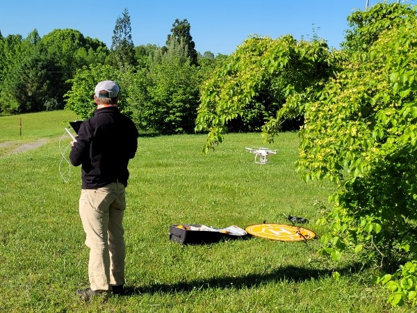
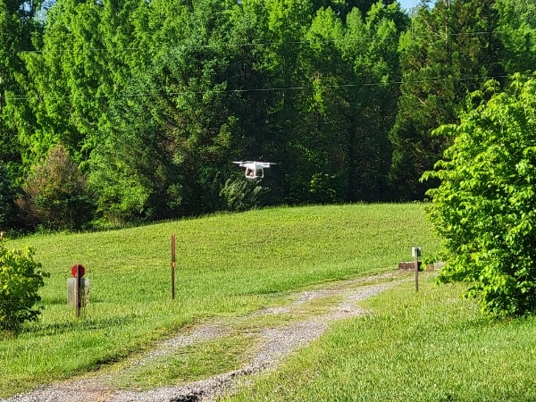

## Drones wake from the winter slumber, and help scientist

Our [dogwood F2 hybrid population](https://journals.ashs.org/hortsci/view/journals/hortsci/44/6/article-p1527.xml) has been and continues to deliver important scientific insights. See [here](https://link.springer.com/article/10.1007/s10681-008-9802-6), [here](https://link.springer.com/article/10.1007/s10681-010-0219-7), and [here](https://link.springer.com/article/10.1007/s11032-011-9551-4).

Now, the plants are older and started flowering. This provides opportunity to re-address the leaf color, in regard to the bracts (flower) color. We also score annually for [powdery mildew (_Erysiphe pulchra_)](https://apsjournals.apsnet.org/doi/full/10.1094/PDIS-01-19-0051-RE) status.

It was great to receive technological support from [Dr. Jamie A. Greig](https://utia.tennessee.edu/person/?id=16986) in documenting the leaf color expression... from the above. This sure makes for some powerful pictures, worth thousands of words (and hopefully at least one good Peer-Reviewed OpenAccess paper).

 
 
 
 
 
 

