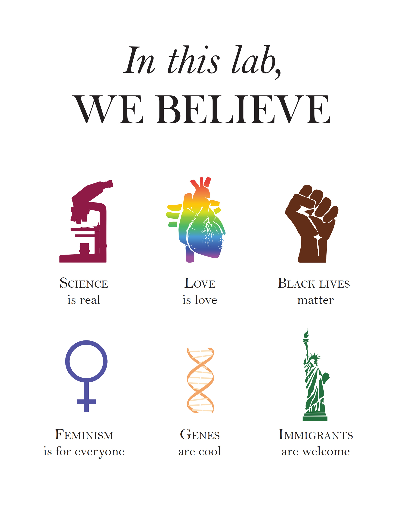

---
slug: equality
---

---title: Month of Equalityslug: equalitydate: 2021-03-31summary: A tribute and a remindertags: ['academic life', 'everyday life', 'lat rats are humans too']img:---## Month of Diversity, Inclusion, and EqualityEvery year, in March we celebrate the diversity of life, and equality of all humans. After dramatic events of 2020, this year we do that perhaps even more so than normally.I am very grateful to our [Depratmental](https://epp.tennessee.edu) Diversity and Inclusion committee and my dear friend and colleague Dr. Denita Hadziabdic-Guerry for the efforts to celebrate women, and other underrepresented groups. Indeed, we have special monthly lunches with guests/videos, and weekly updates with packets of great information. Those change every month, as each month has a different group at focus.So today, on the last day of March, I noted [the great tweet on Dr.Hadzabdic profile](https://twitter.com/TreeHealthDoc/status/1377256218008432640), which follows and underlines [another great resource](https://sammykatta.com/diversity). As all those values are dear to me as a PI and a human being, I embrace them and promote them. In the lab and out. Not only in March. 

