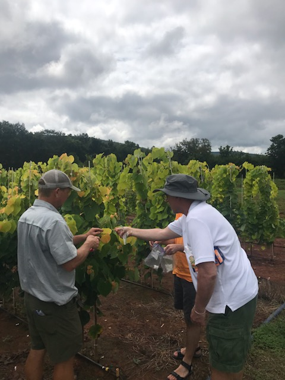
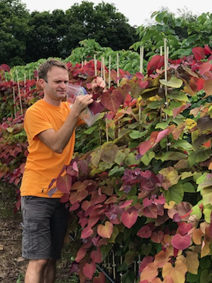
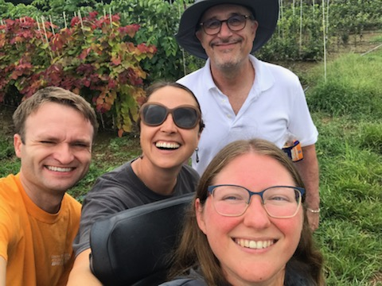
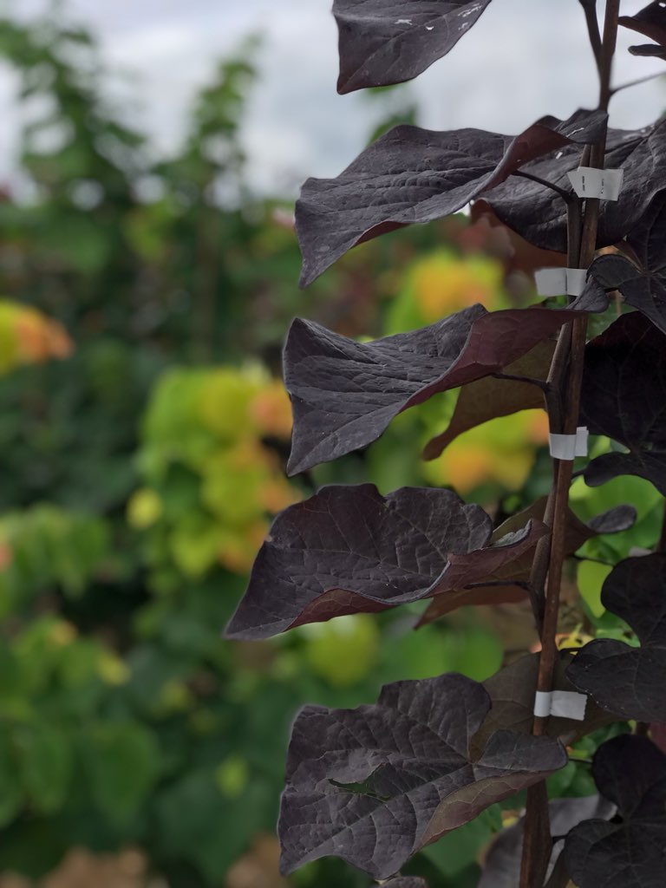
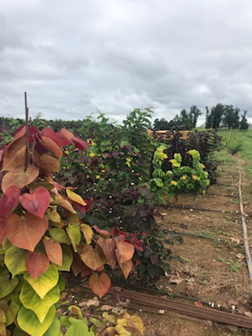
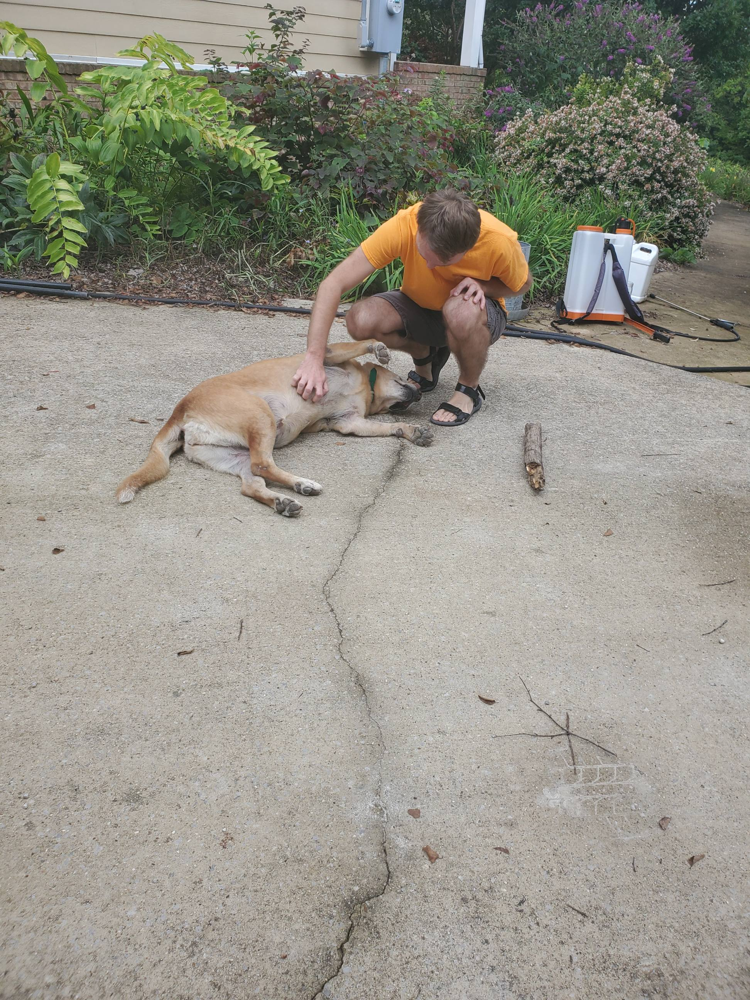

## Roadtrips to redbuds and more

THAT's why we do, what we do!

The Hidden [Hollow Nursery](http://hiddenhollownursery.com) is an exemplary ornamental plants enterprise, and our long-time collaborator. They reside in Belvidere, TN - and the region has many more family-based nurseries that we work with regularly.

We traveled to meet Alex Neubauer, the owner and manager of this nursery. On top of enjoying their spacious operation, HUGE variety of redbuds, dogwoods, and others, we sampled some for our ongoing studies, and discussed future opportunities.

We also took advantage of that trip to visit the Commercial Nursery in Decherd, TN. Overall, the time spent in car was well worth the open air, the great talks, and the inspiration. For the science!

 
 
 
 
 
 

 