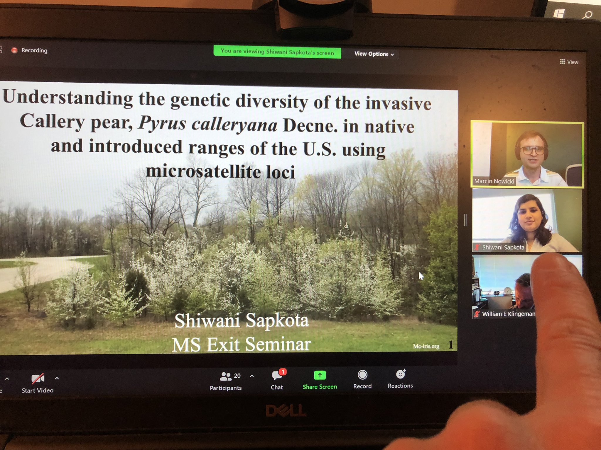

## Shiwani Sapkota defended her MS on Callery pear

Remember [Shiwani](https://journals.ashs.org/hortsci/view/journals/hortsci/44/6/article-p1527.xml)? Sure you do. Those last 2 years went REALLY fast, in part owing to the pandemic. All things considered, Shiwani's project was not an easy one to start with.

 