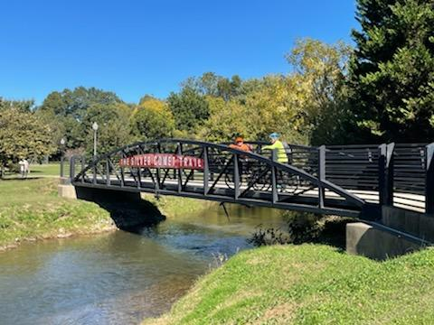

## Catching the last days of good weather this year

I've been outside once. Hated it.

(not really)

But, not every day do I stand the chance to beat my lifelong record of the longest bike trail completed. Following the great idea of [Dr. Trigiano](https://epp.tennessee.edu/people/directory/dr-robert-trigiano/) and [Dr. Hadziabdic](https://epp.tennessee.edu/people/directory/dr-denita-hadziabdic-guerry/), we ventured on a day-long biking. Started [Fri evening](https://www.vikingalchemist.com) to get there, and after a VERY early Cracker Barrel breakfast, we hit [the Silver Comet Trail](https://www.silvercometga.com/silver-comet-map/silver-comet-map.shtml).

It was SO not what I expected!!! The thrill, the sun, the open air, were all a real thing. Of course, trail was densely used at locations around bigger towns, but in general pretty empty. We definitely took advantage of that. 61.25 miles or 98.0 km later, I beat my 94 km from 2000 by a fair amount.

For the curious Georges out there, we did touch on science, but we mostly just had fun and enjoyed our company, cracking jokes and re-telling stories. Perhaps the 60+ miles is not for everyone - including the 39th mile's "OH F^%! THAT" steep climbes, and the 47th mile's "YOU SH$!@#NG ME!!!" surprise hill stretches. But, we definitely felt accomplished at the finish line.

On the way back, it was only proper to reward ourselves with a feast at a [fantastic Bosnian restaurant](http://www.tatasgrill.com). Also, by far I would not be as cheerful as I am about that experience, were it not for the steady and generous helpings of [great supplements](https://www.hammernutrition.com/endurolytes-fizz). #ProductPlacement

Therefore, I am proud to introduce the founding members of **The Cranksters** (cranky + gansters).

 
 
 
 