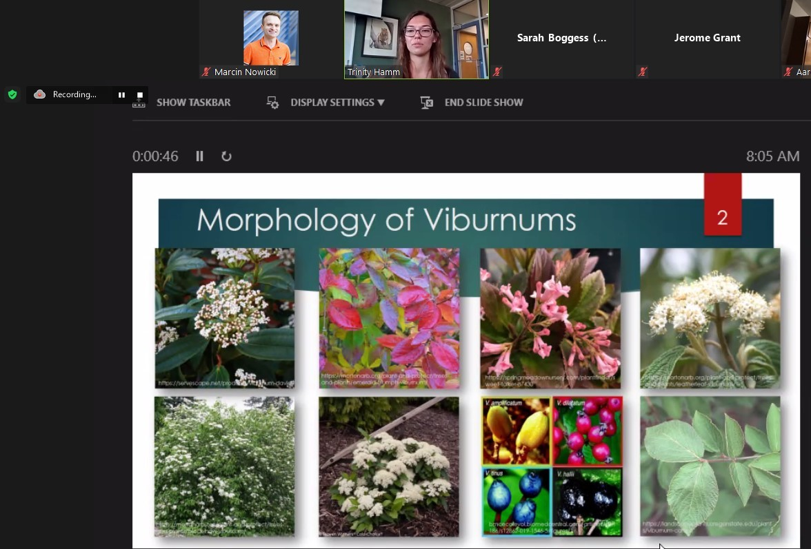
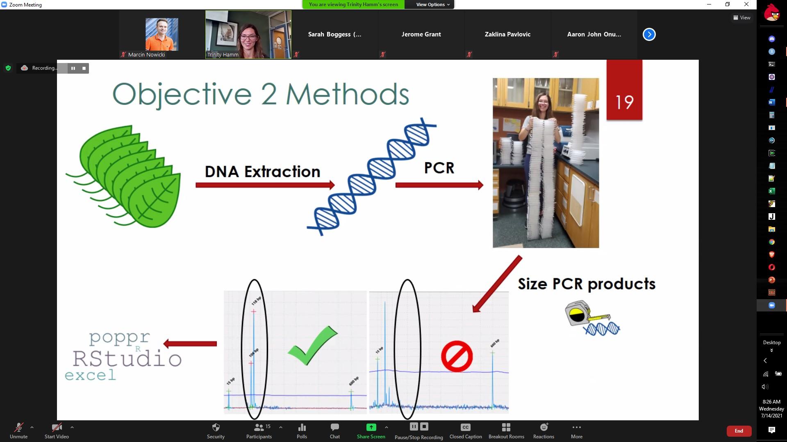

---
slug: trinityms
---

---title: Another MS Student Defendedslug: trinitydate: 2021-07-14summary: Proudly presenting, Trinity P. Hamm MStags: ['research', 'viburnums', 'academic life']img:---## Trinity P. Hamm defended her MS on *Viburnum* As the MS thesis / projects go, Trinity's wasn't an easy one at all!After MANY attempts to tackle the [redbud plastome diversity](/projects/redbud-chlorotyping/), she switched to SSR cross-amplification in _Viburbum_, the Viburnaceae, and Caprifoliaceae. Using this molecular toolbox can help cultivar identification, species delimitation, phylogeny/taxonomy of this HUGE genus, and many similar tasks.Trinity championed this project to some great results and cool insights. First step was, to develop SSRs to the final clade of _Viburnum_ not yet covered. That clade was represented by Asia-native _V. farreri_, with samples of that exotic species generously provided by our dependable Herbaria and Arboreta collaborators. This leg of Trinity's research was [published](/publications/viburnum01/) in [MDPI Plants](https://www.mdpi.com/2223-7747/10/3/487/htm).Once that was done, Trinity analyzed cross-amplification of the entire 4 sets of SSRs (from 4 major clades of _Viburnum_). Here, she used samples of 46 _Viburnum_ species, other Viburnaceae, and even two genera from Caprifoliaceae (_Lonicera_, _Weigela_). Altogether, ~50 markers across 230+ samples.This ambitious MS project was a logistical nightmare under the pandemic, yet Trinity did fantastic job. Final analyses are underway, and this will sure be a great paper to guide future research in these beautiful ornamentals. It was a great honor to serve on Trinity's MS committee, and I was humbled by her dedication to this project and to the science. Therefore, it's great to see that she decided to stay with us longer. I'm sure Trinity's future is bright. Very well done!  

