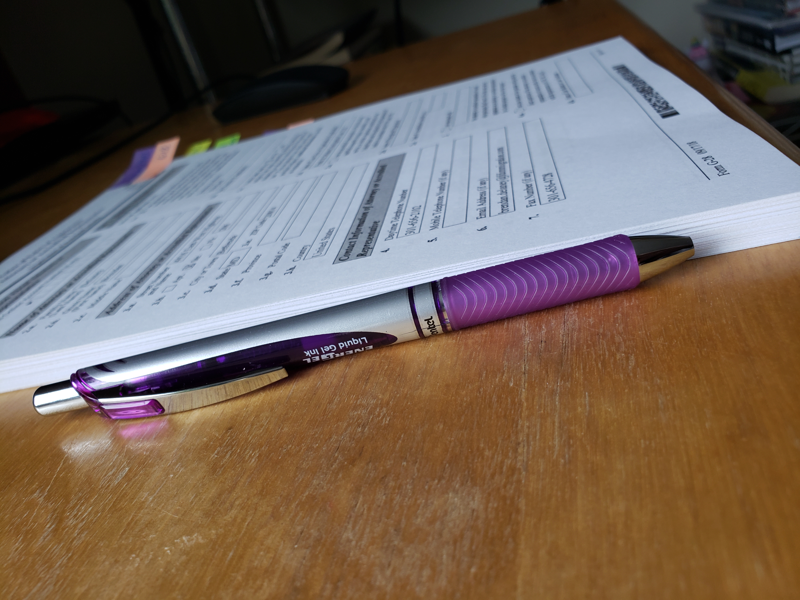
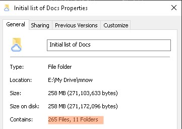
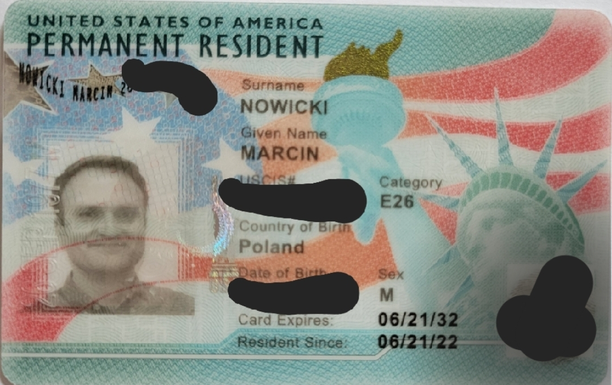

## PI granted permanent residency in the US

Since 2005, my first time in the US, I got infected with the American dream. It is with great pleasure, that I can announce this dream becoming reality.

It "only" took 16 months of nail biting since submission (March 2021), and countless hours of digging and putting together the evidence before that. With the great help of [my immigration lawyers](https://www.fdimmigration.com), it was much easier to navigate these turbulent waters. Further, my personal friends with prior experience in same provided further invaluable help throughout. My case proved strong enought that _no RFE_ (request for additional evidence) was needed.

To see just how much work goes into the application itself (after collecting and collating __TONS__ of other documents, letters of support from around the globe, etc.) - see the picture. The only advice that can be drawn from all this is: **START EARLY**. This helps with the -unnecessary, extra- stress when waiting for the decision, but also permits time to go through the records more thoroughly, finding otherwise overseen docs, etc.

So, many 1000s of $ later, and 2,5 years since the start of the entire deed, it is done. I can breath now - and apply for a 'regular' driver's license. Can also start a side business, take a second job, among MANY other opportunities now open to me. Highly recommend!

 
 
 
