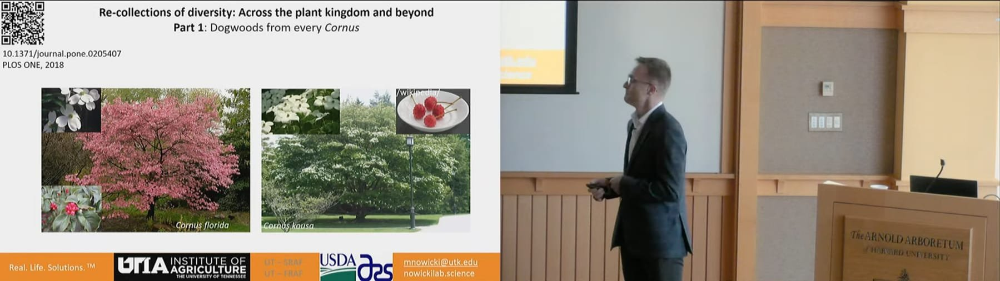
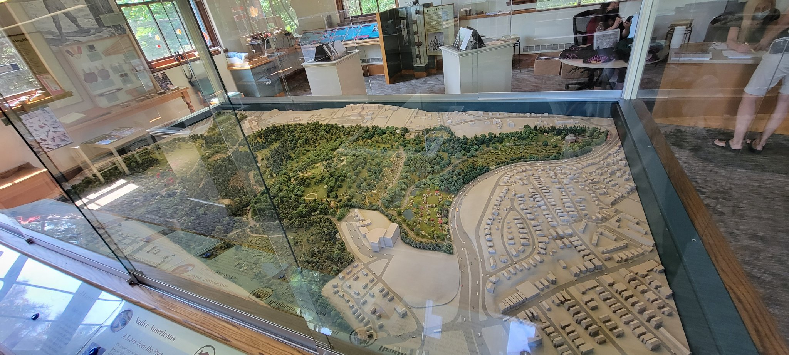
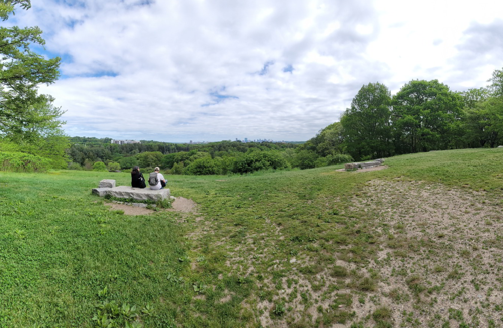
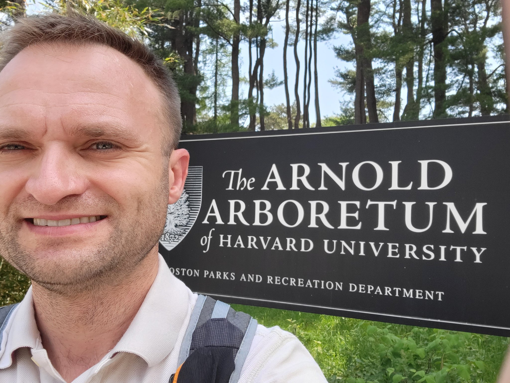

---
slug: plaque
---

---title: Invited talk to Harvard - Arnold Arboretumslug: harvarddate: 2022-05-23summary: Networking makes friendstags: ['academic life', 'presentation', 'arboretum', ' herbarium']img:---## PI gives invited lecture at Arnold ArboretumCollaborations truly yield unexpected results!I am very grateful to [Harvard's Arnold Arboretum](https://arboretum.harvard.edu) for the opportunity to [share my research](https://www.youtube.com/watch?v=_XicJVD_luM#t=26m04s). This was not my first trip to Boston, MA, but sure the first stop at the larger Harvard University. I am very grateful to my wonderful hosts for this platform. It needs to be stressed, that beyond being great at inviting people to present, the main goal of Arnold Arboretum is the preservation of biodiversity and sharing that resource with interested scholars, as yours truly.Below are some snippets of the talk and the arboretum; all around a terrific experience! Cannot wait to go back to work with these great folks.    

