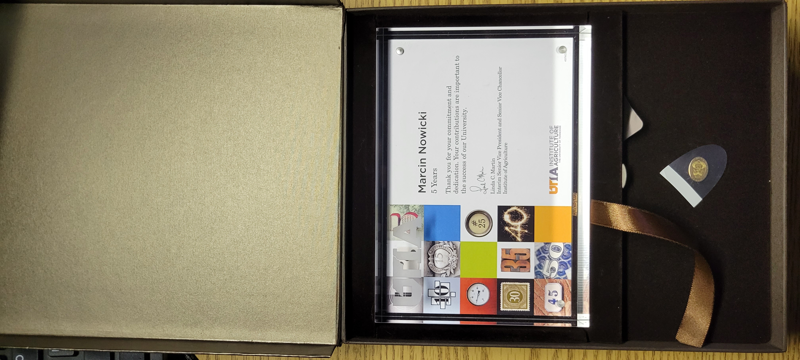

## PI honored with 5-y service plaque

It never ceases to amaze me, how fast time goes by. Especially if I'm working on several projects concurrently, and days/weeks just swoosh...

I am very grateful to [UT Institute of Agriculture](https://utia.tennessee.edu) for being a great host and home to me since my arrival in October 2016. So many things happened those short 5 years - short because it still feels like yesterday when I reached Knoxville TN first time in my life...

So, below is the list for what I'm thankful for.

First and foremost, to [Dr. Robert N. Trigiano](https://epp.tennessee.edu/people/directory/dr-robert-trigiano/), who invited me to work in his lab, and has been and continues to be an amazing mentor and senior colleague. Thank you very much, Bob, for friendship, valuable advice practically every day, and very fruitful collaborations in so many various projects! Always a blast!

My second big "Thanks" goes to the [Department](https://epp.tennessee.edu/) community-at-large, and our truly [fearless leader](https://epp.tennessee.edu/people/directory/dr-dewayne-shoemaker/). It's amazing how much things can change, if a proper person is steering the Department - as this is very much the case. Thank you all for your friendship, care, and all the help.

Thank you to my closest friends and collaborators, nah, family members - [Dr. Denita Hadziabdic](https://epp.tennessee.edu/people/directory/dr-denita-hadziabdic-guerry/) and [Ms. Sarah L. Boggess](https://epp.tennessee.edu/img_2473/). I love you both, and greatly appreciate all the shenanigans as well as all the banter. Thank you for all the life lessons, and for making me a better person.

My great thanks go to our [UTIA](https://utia.tennessee.edu) community and the [UTK](https://tennessee.edu) ecosystem. There are days I'm furious about paperwork and administrative duties, but on so many more days, I can just work through, owing to all the well-oiled machinery in place.

Last but definitely not least, thank you [City of Knoxville](https://knoxvilletn.gov)! I did not know what to expect, but was very uplifted, when a random security guard told me on my way here "There's plenty of great food down there!". This was true - and as a proud foodie, I enjoyed thoroughly every bite. But there's so much more here! The Greenway system and the great outdoors; fantastic weather; vibrant Downtown; the amazing trolleys; amazing people; SKnox... The list goes on and on. 

So, here's to more years to come - hopefully just as joyful and productive!

 
