---
slug: portspain
---

---title: Intercontinental impactsslug: portspaindate: 2022-09-19summary: Forestry connectionstags: ['academic life', 'networking', 'societal meeting', 'forestry']img:---## New friends, new places, new IUFRO congressScience will take you places!For instance - to Lisbon (Portugal), or Pontevedra and Madrid (Spain).Joined by the fantastic team of [Dr. Hadziabdic](https://hadziabdiclab.utk.edu/welcome/people/) and our magnificent technician Sarah Boggess (and her mom in tow), we explored what the Iberian Peninsula had to offer. The reason was the back-to-back meetings in our field: the [IUFRO congress](https://iufro-lisbon2022.com/) and the comparably much smaller, cameral [IUFRO workshop](https://www.gtpi2022.csic.es/) on forest pathology.Dr. Hadziabdic attended both meetings; but Sarah and yours truly only the second one, where we presented progress on molecular detection and dogwood genetics genomics in the context of powdery mildew. This presented us with great opportunity to explore Lisbon and the greater area. What a treasure trove! Both Portugal and Spain remain in our collective opinion, a tourist paradise - if only you venture off the beaten track a little bit. We enjoyed the vistas, the sunsets over the ocean, fresh seafood, bread and wine... TONS of culture to absorb, TONS of wonderful memories made, TONS of new scientific friendships and opportunities explored.We would be remiss if failed to mention the extraordinary hospitality of the IUFRO organizers with the above-and-beyond chief, [Dr. Luis Sampedro](https://www.researchgate.net/profile/Luis-Sampedro). Science REALLY thrived those several days in Pontevedra. Our geeky hearts and souls were full.  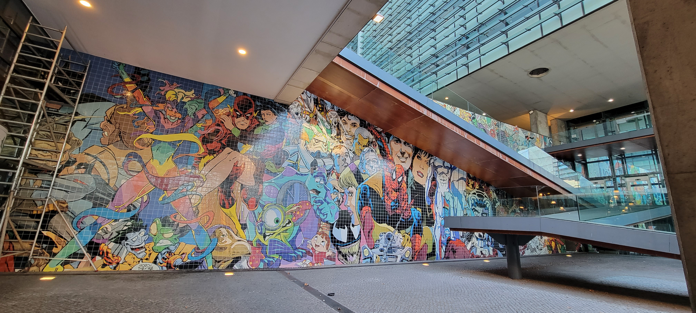 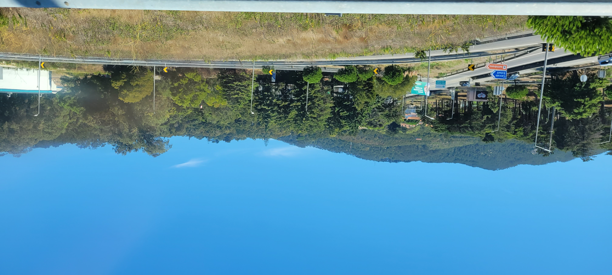 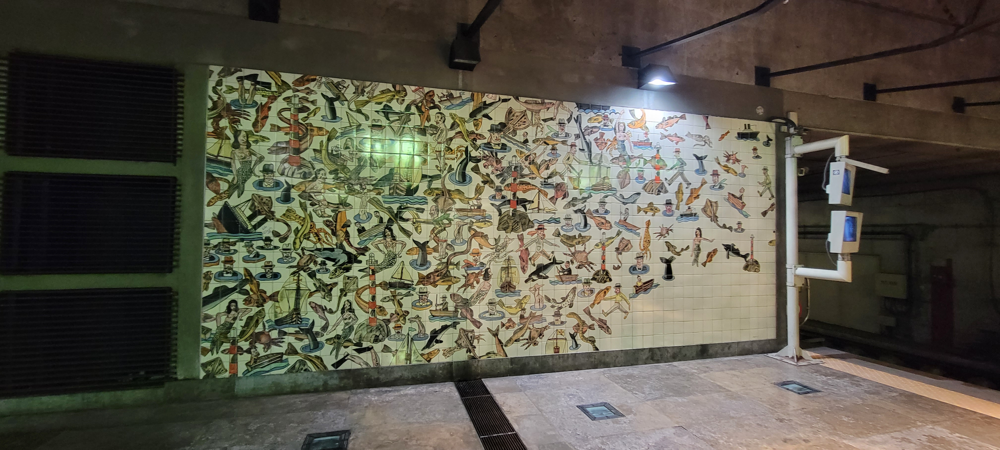 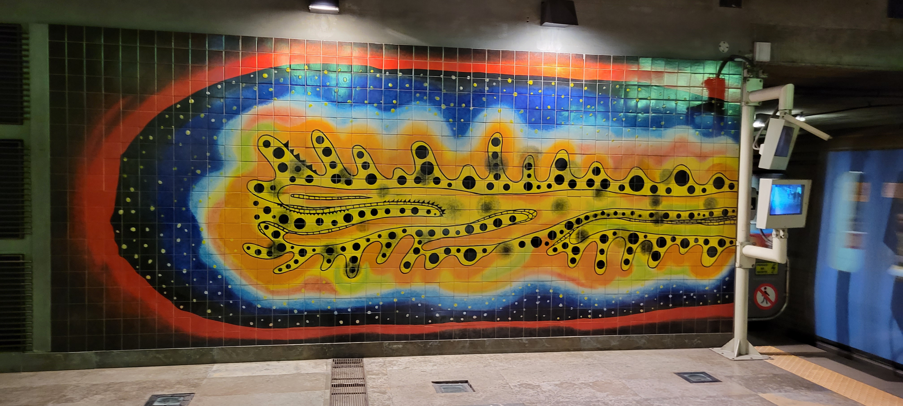 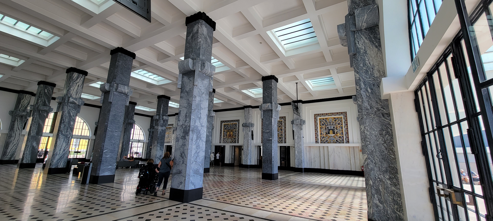 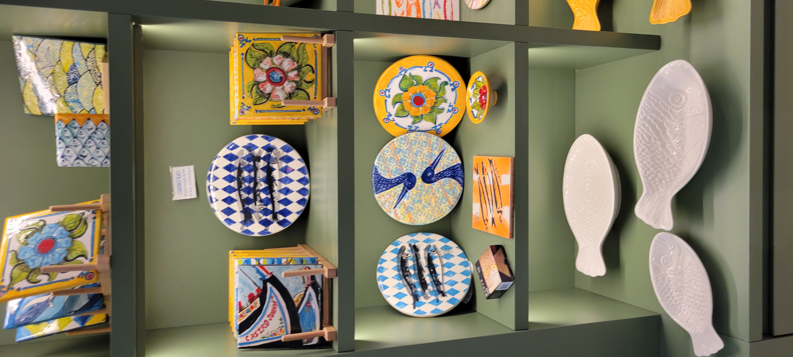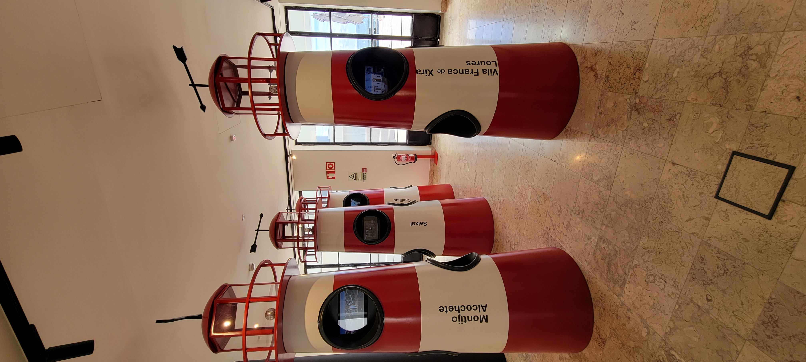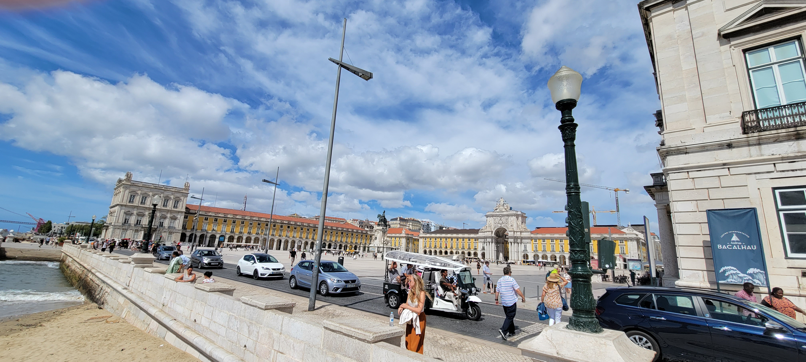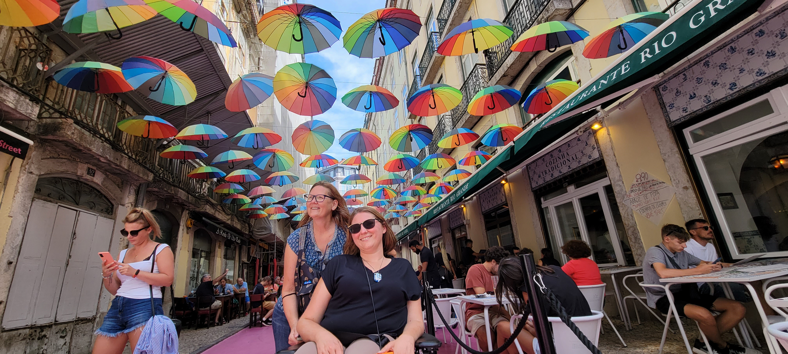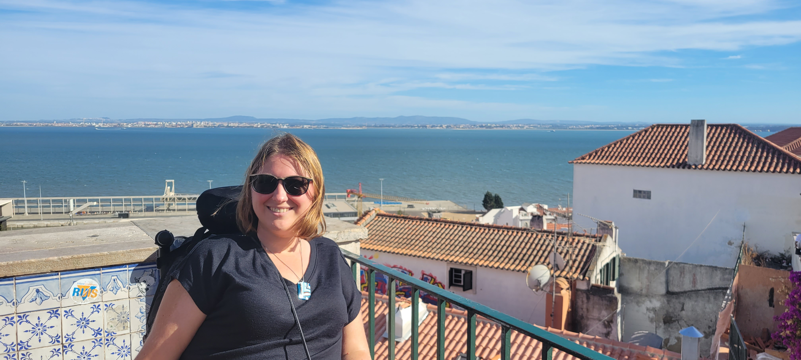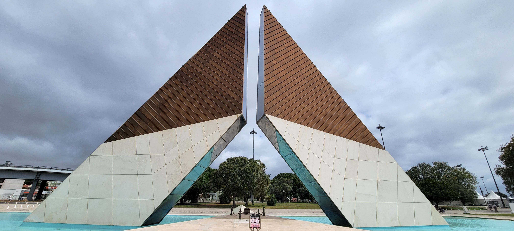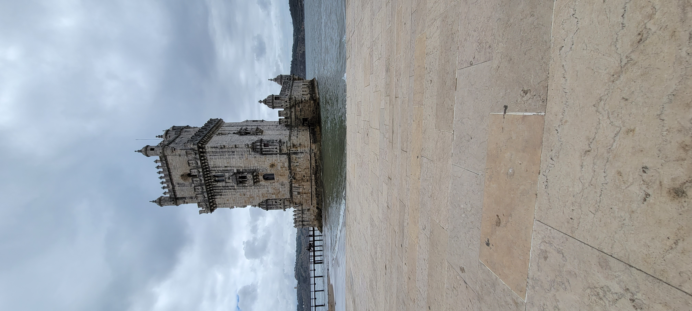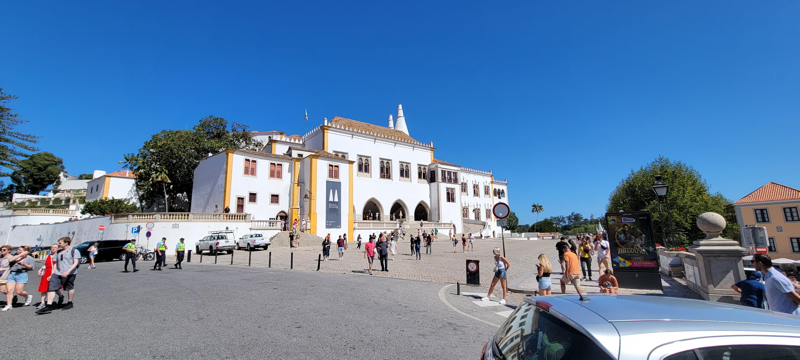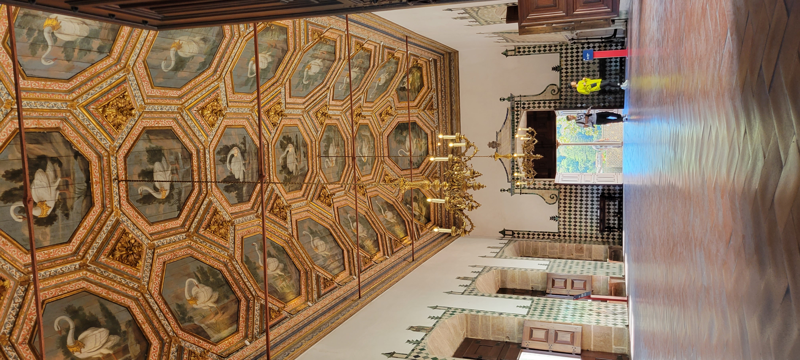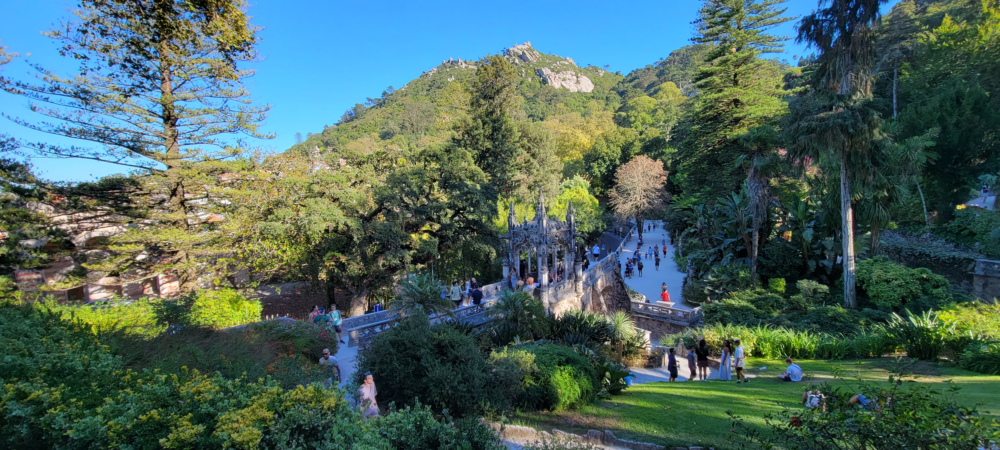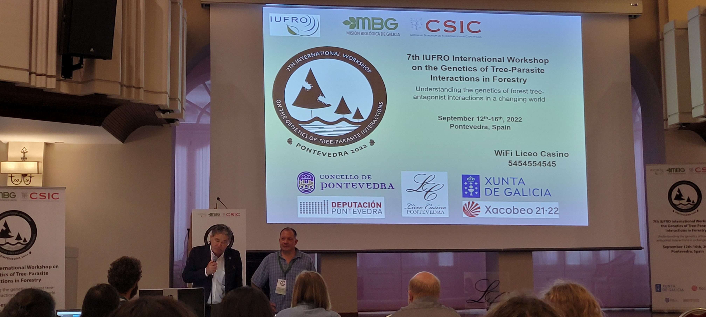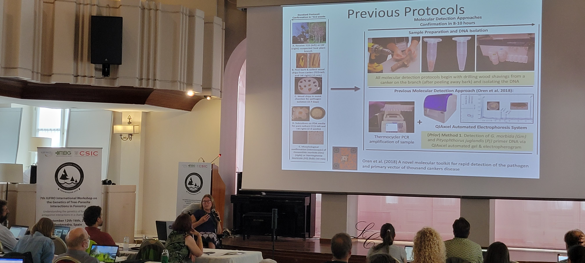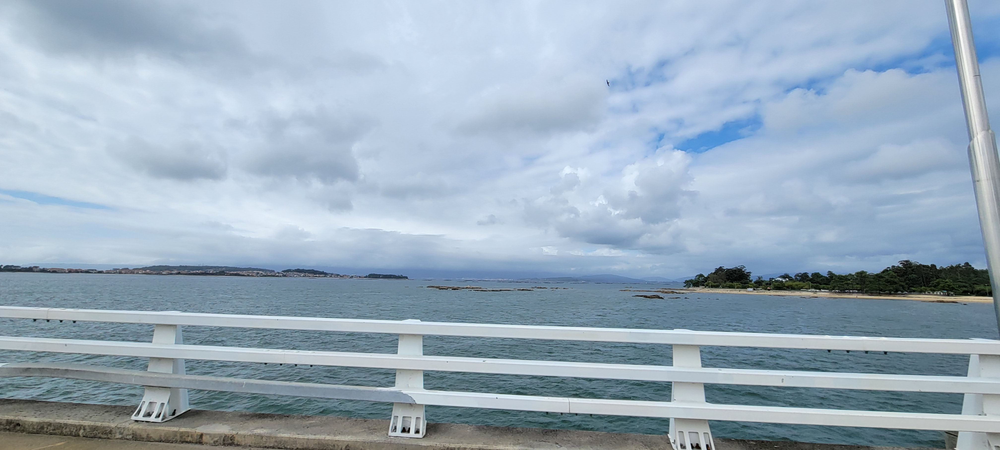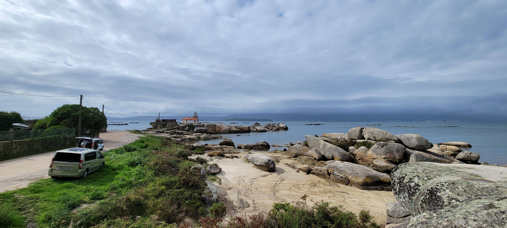, but also to explore that vibrant city.")

