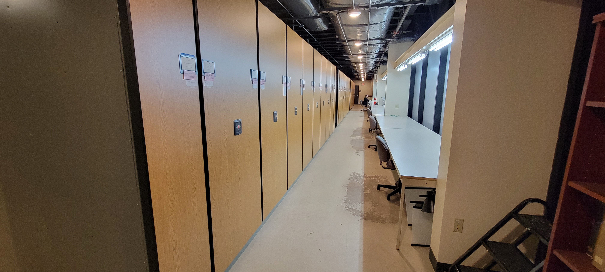
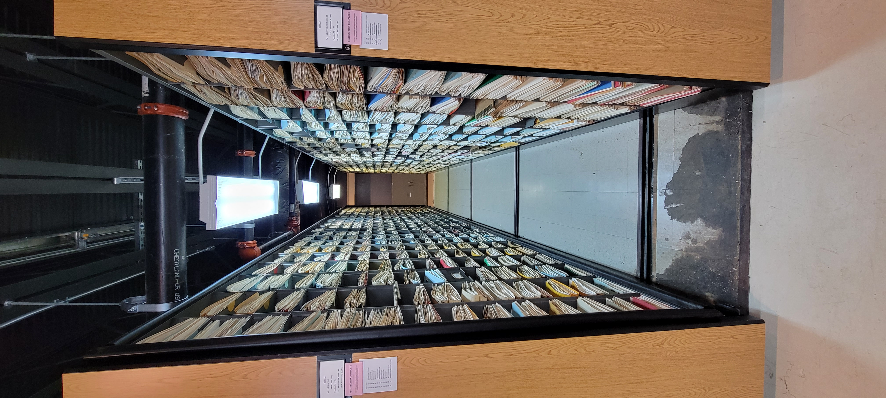
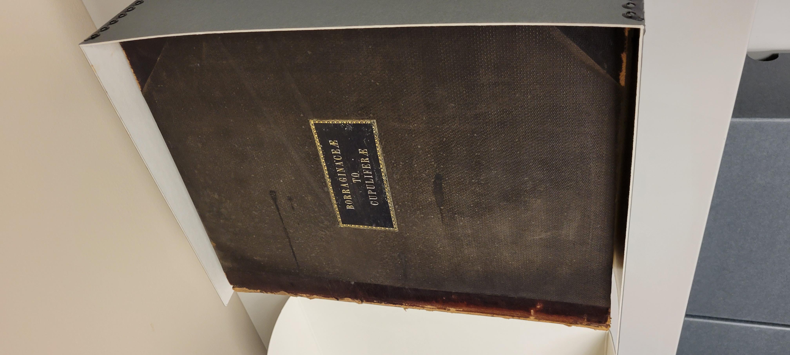
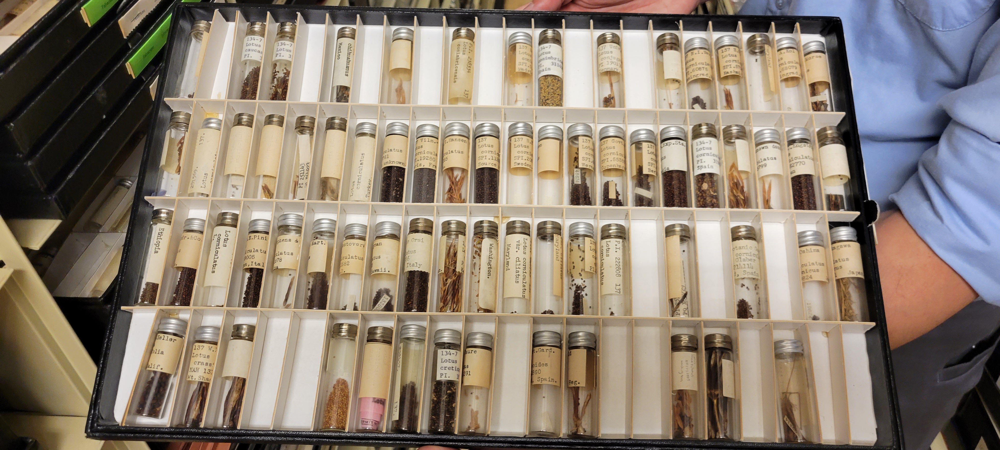
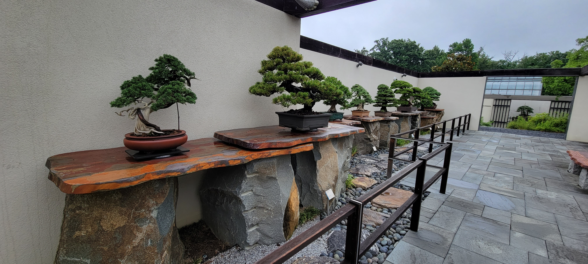
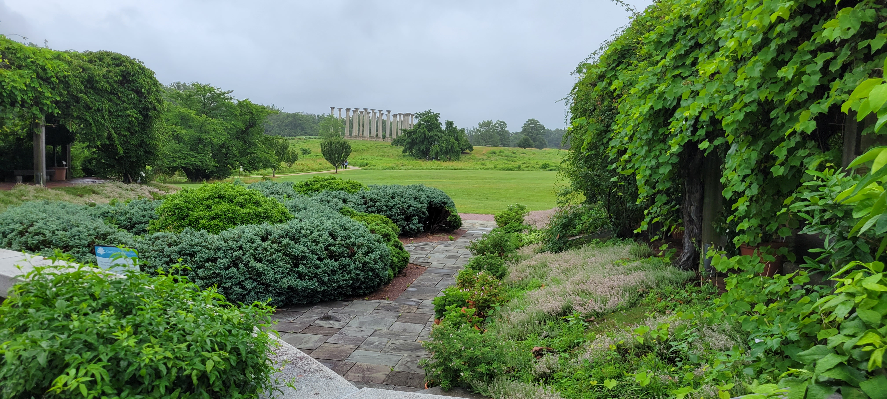
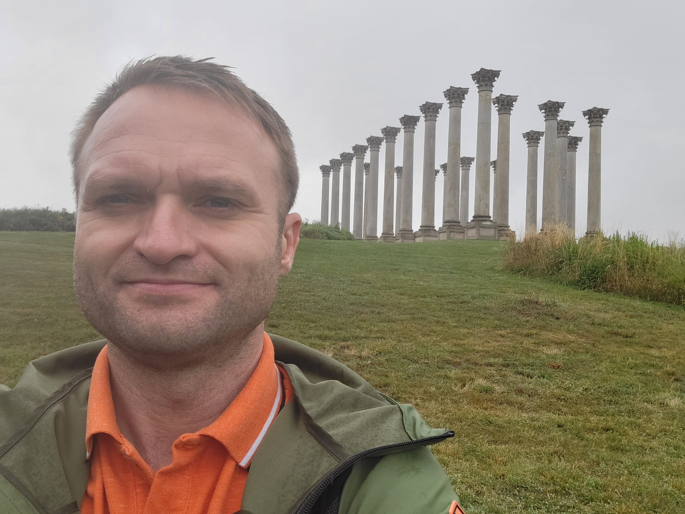

## When in ~~Rome~~ DC...

The plant collections - live (arboreta) and preserved (herbaria) are the staple in our group's reseach. It is with great delight, that I'm getting to know the people behond all this magic.

The recent example was the visit to the great [Arnold Arboretum](/news/harvard). This time, taking advantage of a trip to Washington DC, I visited the breathtaking [USDA National Arboretum Herbarium](https://www.usna.usda.gov/science/u.s-national-arboretum-herbarium/).  

[Dr. Harlan Svoboda, the Herbarium Curator](https://www.usna.usda.gov/science/our-scientists/), graciously walked me over and across the available resources. On top of the __VERY__ impressive pressed collections, the visit was very educational. I learned about the largest collection of the cultivated specimens. And about the seed herbarium. And about the troublesome housekeeping and some possible future developments. All mind-blowing, and very inspipring for the future research.

After that awesome visit, despite uncooperative weather, I took a walk around the grounds. All sorts fo wonderful collections are there, including the balance-restoring, zen-like bonsais. The oldest was from 1600s!

Thank you for the opportunity to visit, to talk all directions of science, and for finally brining this long=lasting collaboration to life. Here's to future common prospects! (yes; plural!)

 
 
 
 
 
 
 
