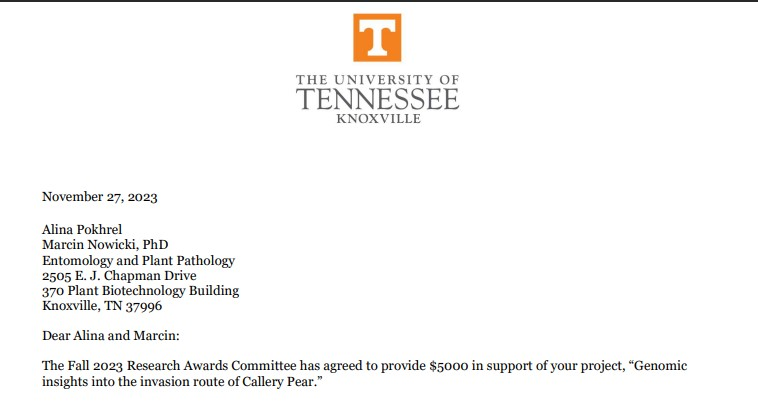
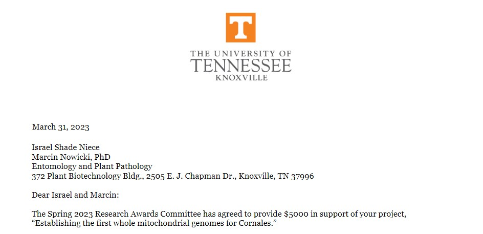

## Hard work pays off... with more work

My pride and joy - mentoring the students.

UT has this worderful thing, where both undergraduate and Grad School offer research awards. On the one hand, this helps the research going on. On the other hand -arguably more importantly- this helps the students get their feet wet with laboratory research.

In our lab, the grad students get encouraged to go one extra step beyond the bare minimum. This is in hopes to (1) strengthen their research projects; (2) increase their chances on the ever-more-stringent job market. Whou **WOULDN'T** like to mentor a student who already had received a competitive grant...?

Thus far, all of our grad students were fortunate to apply and receive the [Student-Faculty Research Award](https://gradschool.utk.edu/costs-and-funding/graduate-fellowships/graduate-student-research-awards/) from [UT Grad School](https://gradschool.utk.edu/). Sometimes it took more than one try, but it's a process - meant to make us all learn. These competitive awards have success rates between 10 to 20%: Enough to feel encouraged, but also enough to **REALLY** make you try your best with the proposal.

Recent successes in this area include [Shade](../../../people/shade-niece/), who in Spring 2023 received funding to decipher the phylogenomics in Cornales. To top that off, [Alina](../../../people/alina-pokhrel/) received support for population genomics of the invasive Bradford pear.

It may seem little - but here we make $5,000 go a long way! Stay tuned for the great outcomes we all expect and await!

 
 
