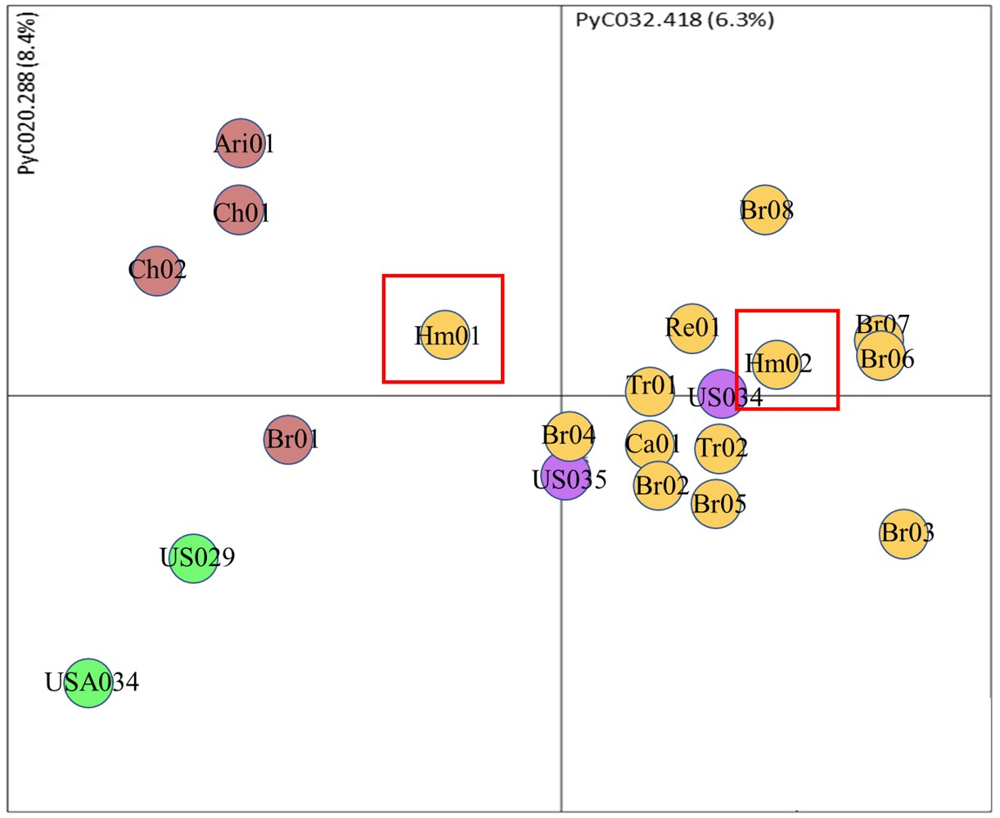

## New project, new peeps

This Spring/Summer, I was fortunate to come up with an attractive research idea. We want, in a very simple way, to try explain how *P. calleryana* was able to escape cultivation.

As other species of the rose family, Callery pear is self-incomaptible. This means that the pollen of a given tree will not result in a fruit with viable seed on that same tree.

To genotype the historical (confirmed) and the current specimens of cultivated *P. calleryana*, we tapped the preserved (herbaria) and live plant collections (arboreta). We also used [our previously collected specimens](/publications/pyc/), see the picture below. We will use the genotyping system established for many other pear species, including PCR, gel fragment analysis, sequencing, and downstream analytics.

[UT Office of Undergraduate Research](https://studentsuccess.utk.edu/urf/getting-started/find-opportunities/semester-research-assistants-program/) gave us a nice financial starting push for this research, and we found a great incumbent to work on this. Very exciting!!!

More soon, as the project progresses.

