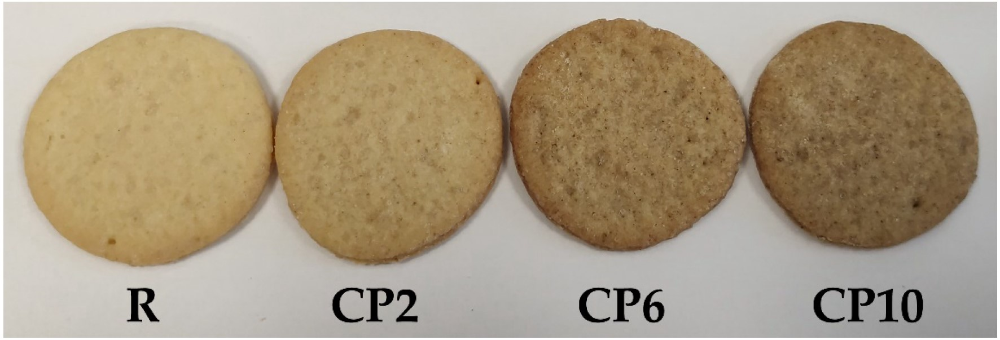

## 5th paper out in 2021 
# Who's counting

Who wants a snack break? I brought cookies...

Growing human population makes scientists look for protein of the future in unusual places. Crickets is one of them #TastesLikeChicken. In our [just-published paper](https://www.mdpi.com/1420-3049/26/17/5417), we analyze how partial replacement (up to 10%) of wheat flour wuth cricket powder changes the functional and nutritional properties of biscuits. 

Consumer acceptance ratings for reference and 2% cookies were comparable, but higher levels of replacement scored worse. Such a small change in the recipe resulted in nutritionally desirable enhancements in the biscuits:  increase in the protein content, including essential amino acids, as well as minerals and fat. This also affected the physical properties of the biscuits, including hardness, and water molecular dynamics measured analyzed by 1H NMR.

Cricket powder-augmented biscuits join the line of enhanced, functionally superior food products. This and similar food augmentation provide a viable scenario to meet the human food demands in the future.

