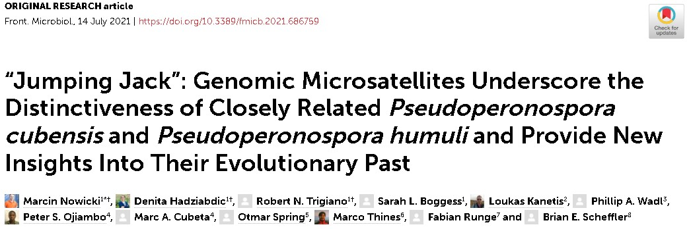

## 4th paper out in 2021

In the summer heat, things keep to simmer in the lab and in the press.

Our another BIG paper uses the molecular markers (microsatellites; SSRs) to deliver an ultimate piece of evidence in downy mildew pathogens separation. Using population genetics tools, we uncover the evolutionary scenarios of the speciation between *Pseudoperonospora cubensis* and *P. humuli* (Oomycetes causing downy mildews of, respectively, cucurbits and hop).

In our [just-published paper](https://www.frontiersin.org/articles/10.3389/fmicb.2021.686759/full), on top of all other findings, we capture the ongoing speciation within *P. cubensis* itself, hinted at several times before. We also apply comparative genomics to some astounding (and very sobering!) conclusions.

Work on this paper was challenging, owing to its multi-layer character, dearth of data and analyses, and number of co-authors whose pertinent comments and advice needed to be implemented. Overall, I'm very pleased with the outcome, and so seems the whole team of Authors. More to follow, for sure!

 and sequence data (C)")