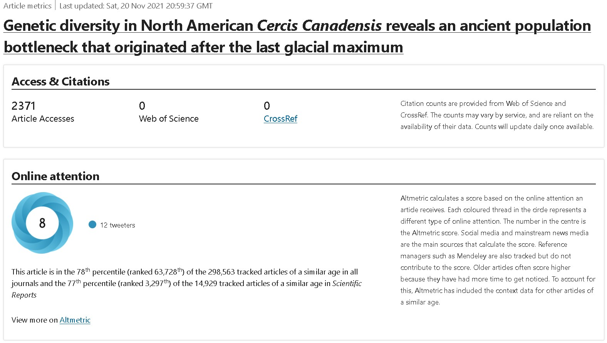

---title: Eastern redbud diversity across native rangeslug: redbudbigscaledate: 2021-11-08summary: Sampling across native range illuminates redbud's evolutionary historytags: ['redbud', 'Meher A. Ony', 'Cercis canadensis', 'species diversity', 'evolution']img:---## 6th paper out in 2021 ## Enough is enoughIt was A LOT for [Meher](/projects/redbud-diversity/) to handle, and she did it like a champ!The beautiful [eastern redbud](https://en.wikipedia.org/wiki/Cercis_canadensis) may not be ecologically super important; some consider the species a "trashy" one. Even then, it takes a lot of skill to make a strong scientific impact using such a model.Drawing from a **HUGE** network of [collaborators](https://www.nature.com/articles/s41598-021-01020-z#Ack1) (also used in other projects; more to come soon), Meher genotyped the species essentially throughout its native range - see the map below. She used 12 microsatellites from [her previous paper](/publications/redbud-fine-scale/), tested across **hundreds** of samples (691 to be exact; 74 populations). You can only imagine the long hours spent in the lab, and later at the computer, to make sense of the data!The gist is, we found high genetic diversity and limited gene flow in those natural stands of *C. canadensis* that are explained by two major genetic clusters. Exploration of the data also indicated an ancient population bottleneck that occurred coinciding with the last glacial maximum (LGM) in North America.The structure in the extant redbud populations likely originated from an ancient population in the eastern U.S. that survived LGM and later diverged into those two genetic clusters. Populations have expanded since then from one into several post-glacial refugia that now occupy this species’ current range. Our findings can direct future efforts in conservation and resource utilization of adaptively resilient populations that present the greatest genetic and structural diversity.I was very fortunate to be involved in all that to some extent, teaching Meher some powerful tools used for the data analyses, and generating that beautiful map to match [Dr. Hadziabic](https://epp.tennessee.edu/people/directory/dr-denita-hadziabdic-guerry/)'s favorite color scheme.## EDIT 2021-11-20 What we did NOT expect, was the splash this paper made. At mere 12 days after publication (which is a whole other story, why we will never again publish in SciRep), the metrics are mindblowing. This perhaps best showcases how good that paper is, and documents the fantastic job Meher led.

