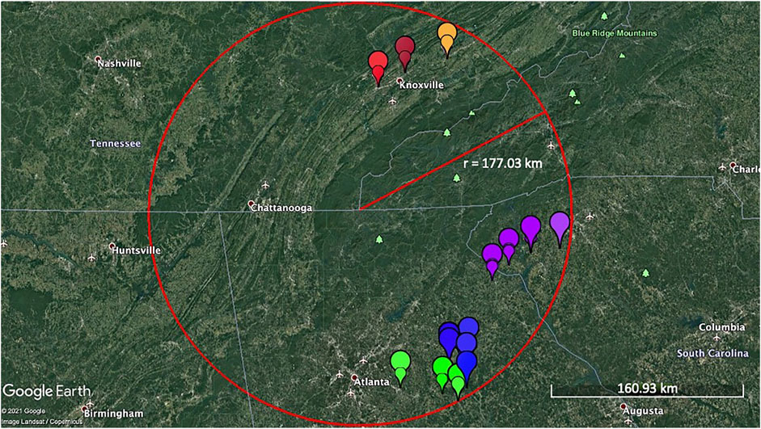

## 1st paper out in 2022

So, [Shiwani](/projects/asian-callery-pear/) is a rockstar. She was offered a job months before graduated. In the meantime, and after graduation, she kept working on the 2nd paper from [her MS thesis](https://trace.tennessee.edu/utk_gradthes/6127/).

We were fortunate [to publish this exciting story](https://www.frontiersin.org/articles/10.3389/fgene.2022.861398/full) in Front Genet Research Topic [Genomic basis of adaptations to new environments in expansive and invasive species](https://www.frontiersin.org/research-topics/22532/genomic-basis-of-adaptations-to-new-environments-in-expansive-and-invasive-species#articles) - a great fit!

Using the [previously developed markers], we assessed the diversity and evolutionary history of balanced sampling on both sides of the Appalachian Mountains. Lo and behold, _P. calleryana_ shows the **model** features of invasive species. High number of alleles (=diversity), high migration rates (=effective spread), and **very** high mutation rates (=adaptation) were all detected.

Further, we found that the spread to the North of Appalachia was secondary, as the initial invasion happened on the Eastern (=Southern; Atlantic) side of the mountains.

All together - a chilling realization of what we're dealing with. Further developments will follow.

