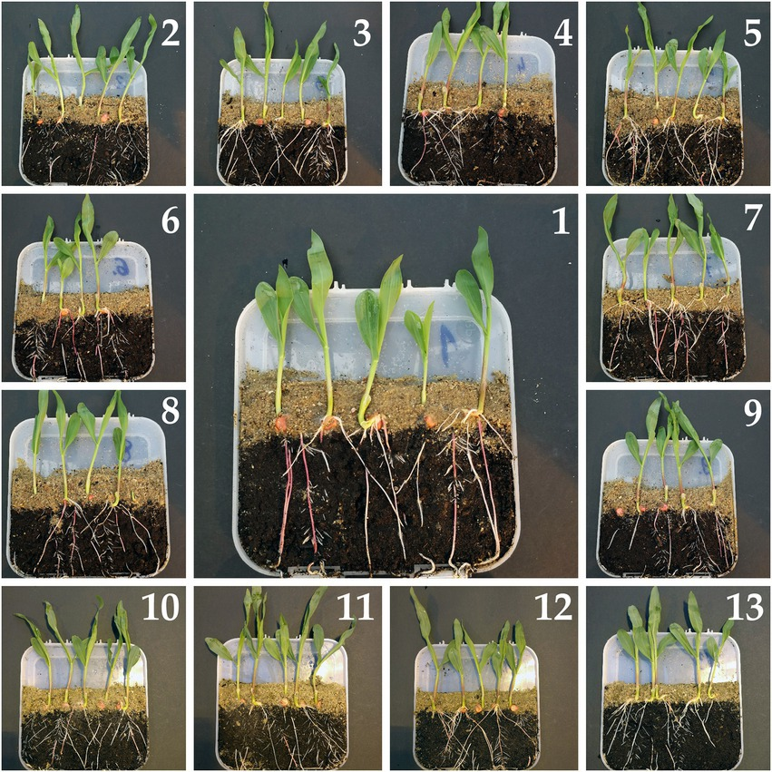

---
slug: sdhi
---

---title: Drought impacts and where to find themslug: sdhidate: 2022-08-30summary: Maize is stressed, too.tags: ['plant physiology', 'collaboration', 'abiotic stress']img:---## 3rd paper out in 2022Building on the existing collaborative research networks, with the [PULS](https://skylark.up.poznan.pl/en/) [scholars](https://puls.edu.pl/en/phd/faculty-food-science-and-nutrition) [we studied maize](https://www.frontiersin.org/articles/10.3389/fpls.2022.984248/full). Specifically, how various maize seed treatments affected the germination and many physiological parameters of the seedlings under and after drought. Seed treatments are one possible way to tackle water scarcity - a resource that is much needed for good yields of maize.Comparisons of reactions with and without SDHI (sedaxane) showed that this treatment bears a lot of promise for maize. SDHI improved seed germination, development of root system, and overall boosted the seedling physiology regardless of the presence of drought.What's next then?Field testing of SDHI (or related) treated maize seeds, to assess the extent of this treatment on the actual plant growth and yields. Fingers crossed!

