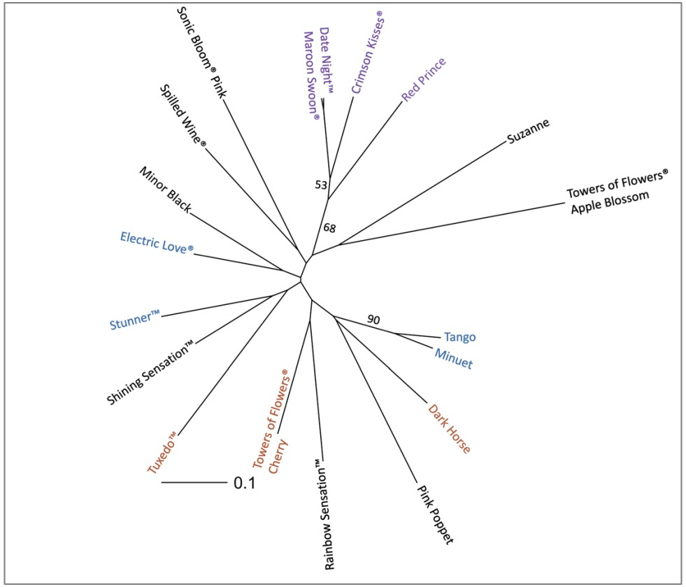

## 3rd paper out in 2022

Another rockstar, ladies and gents. [Trinity](/news/trinity-cpdna-seminar/) chose to stay with UT for her PhD studies. As a first subject, she developed SSR markers for the beautiful ornamental *Weigela* spp. It's **hard** to track all the between-species hybridaztions people have made to get more beautiful shrubs, and gain from their sales. As such, we wanted to shed some light onto this complex, using molecular approaches.

Using the available transcriptome, she tested 50 SSRs, and used 20 robust, high-quality markers to analyze 18 cultivars. Owing to their location to the coding parts of the genome (and their expected spread across it due t lack of linkage disequilibrium), they can be used to many analytical purposes: cultivar proofing; species diversity and delimitation; marker-assisted breeding for desirable traits...

This study was published in [MPDI Plants](https://www.mdpi.com/2223-7747/11/11/1444), and I'm very happy I was able to help a little bit along the way: #ForThebeautifulWeigelas! We are also grateful for the help from our USDA - ARS collaborators, and are looking forwards to #MoreWeigela.

