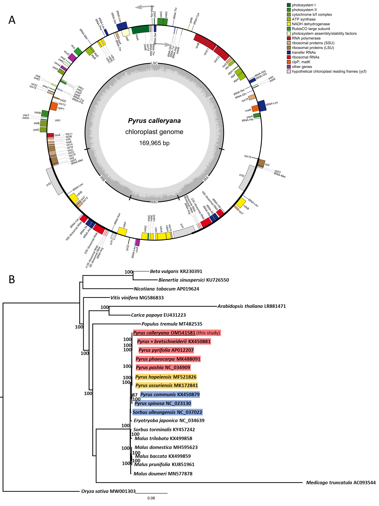

## 2nd paper out in 2022

Considering the ecological trouble that *Pyrus calleryana* generates, it's amazing how few genomic/molecular resources are available. In this study, I used the conventional reference-based genome assembly, to generate the plastidial genomes of this species. The story was published in [Journal of Applied Genetics](https://-link.springer.com/article/10.1007/s13353-022-00699-8#Abs1), which only publishes 70-80 papers a year.

Chloroplast genomes typically have a four-part architecture, and this one was not different (Fig.1A). Furthermore, genomes of other pear species aligned according to their geographical origins, placing species from Asia together (this includes Callery pear), then intermediates of Middle Eastern/Syberian pears grouped together, then the European/Mediterranean species again together (Fig.1B). This genome was very similar to the reference, the largest pear cp genome available (Suppl.Fig.1).

But, when compared within 4 genomes of _P. calleryana_, generated from [4 availables NCBI read archives](https://www.ncbi.nlm.nih.gov/sra/?term="Pyrus+calleryana"+AND+"green+plants"%5Borgn%3A__txid33090%5D), we detected higher within-species molecular variablility (Suppl.Fig.2) than reported in other studies, in agreement with our [other](/publications/pyc/) [studies](/publications/pyc2/).

This paper marks my long-awaited break into genomics, another dimension of my bioinformatics skill repertoire. I'm very grateful to the Co-Authors for help and guidance, and looking forward to further developments (on which we're working hard!)

