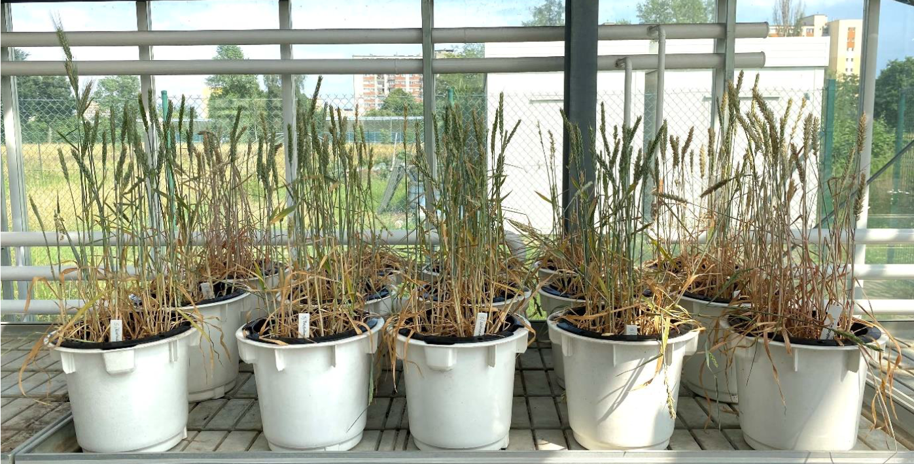

## 5th paper out in 2022

In a similar research to [maize](/publications/sdhi/), [we](https://puls.edu.pl/en/phd/faculty-agronomy-and-bioengineering) tackled how wheat responds to drought and [what biostimulants help it mitigate the stress impacts](https://doi.org/10.1371/journal.pone.0280037). This cereal remains an important row crop across the world, so concerns about climate change and its possible impact on yields -and thus feeding the human race- prompted our study. Furthermore, due to environmental concerns, the chemical treatments of seeds and plants by fertilizers and similar get increasingly restricted.

Under such considerations, we investigated how a score of biostimulants impacts wheat tolerance to drought. *Bacillus* sp., soil bacterial strains, free amino acids, and humic substances on winter wheat seedlings were assessed in a pot experiment under full hydration soil moisture and under drought. Among the studied biostimulants, the two based on bacterial strains had the strongest beneficial effects on improving the tolerance of wheat plants to drought. We assessed that based on several physiological and biochemical parameters such as photosynthesis efficiency, stomata physiology, and drought stress resistance index.

These encouraging results from our greenhouse pilot tests need to be confirmed in the field studies. But at least we found strong contenders to such large-scale trials, to help combat the drought-related yield losses of wheat.

