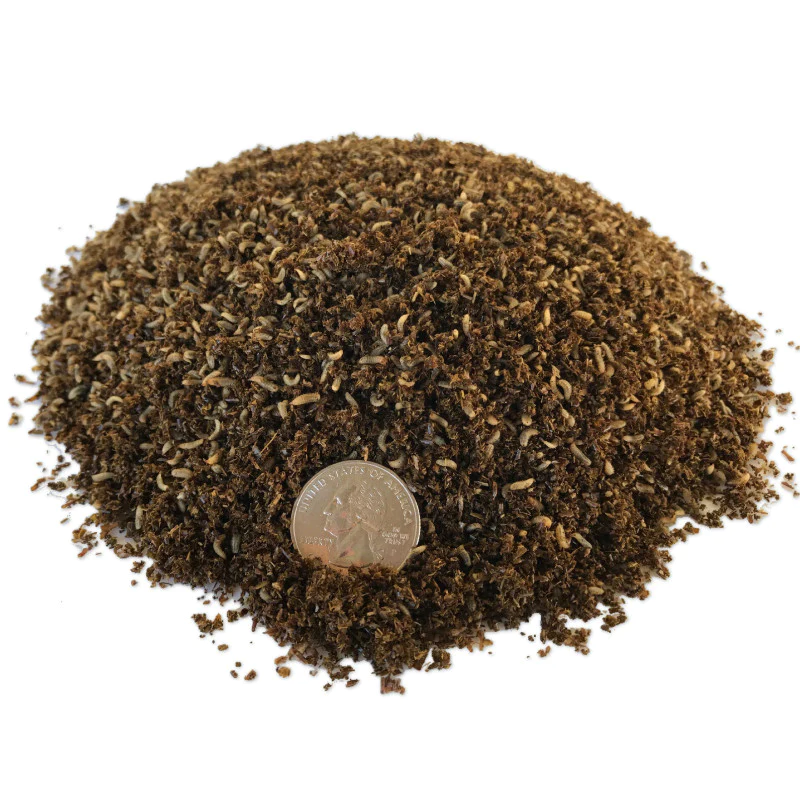

## 1st paper out in 2023

[Another paper](https://doi.org/10.1371/journal.pone.0280037) that focuses on food sources and possible ways towards yield improvement. [We](https://puls.edu.pl/en/phd/faculty-food-science-and-nutrition) have tested application of more environmentally neutral biofertilizers - in this case, black soldier frass vs. the commercial cattle manure in the cultivation of basil under drought.

Health and physiological condition of plants were assessed based on gas exchange, parameters for photosynthetic efficiency, mineral and biochemical profile of basil, and similar. Biofertilizers improved the fresh mass yield and physiological condition of plants, both under optimal watering and drought, in comparison with the non-fertilized controls. Compared with the cattle manure frass turned out a superior strategy to boost output and reduce the effects of drought on basil production.

